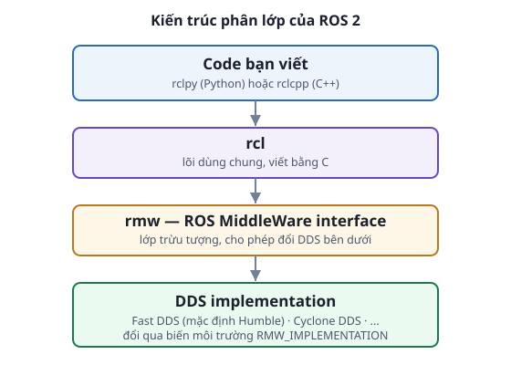
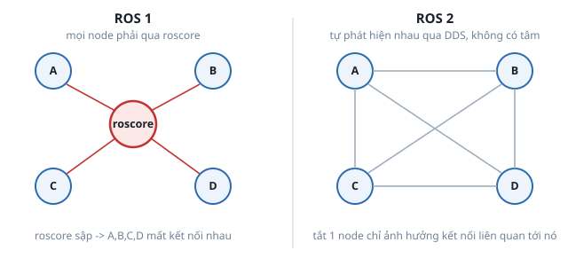
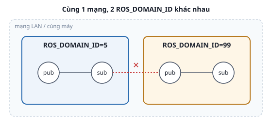

# 1. ROS 2 và kiến trúc DDS

*[← Mục lục module](00-gioi-thieu.md) · Tiếp theo: [Node →](02-node.md)*

## Định nghĩa

**ROS 2** là 1 framework — thư viện + công cụ + quy ước giúp nhiều tiến trình (node) độc lập phối hợp như 1 hệ thống. **DDS** (Data Distribution Service) là chuẩn middleware publish/subscribe công nghiệp có sẵn — ROS 2 dùng lại làm lớp giao tiếp nền tảng, không tự viết networking riêng.

## Cơ chế

**Kiến trúc phân lớp**: code bạn viết (`rclpy`/`rclcpp`) → `rcl` (lõi C dùng chung) → `rmw` (lớp trừu tượng) → 1 DDS implementation cụ thể (Fast DDS mặc định Humble, hoặc Cyclone DDS). Lớp `rmw` cho phép đổi DDS bên dưới mà không sửa code node.



**Không cần `roscore`**: ROS 1 có 1 tiến trình trung tâm (`roscore`) — mọi node đăng ký qua nó, nó sập là toàn hệ thống mất kết nối. ROS 2 bỏ hẳn khái niệm này — mỗi node tự "rao" và tự "nghe" node khác qua discovery của DDS (UDP multicast), không ai giữ vai trò trung tâm.



**`ROS_DOMAIN_ID`**: 2 tiến trình chỉ thấy nhau khi cùng giá trị này (mặc định `0`) — giống chia VLAN, cô lập nhiều hệ thống ROS 2 trên cùng 1 mạng.



## Ví dụ trong bài học

```bash
printenv | grep -E "ROS_DOMAIN_ID|RMW_IMPLEMENTATION"
```
Trên máy viết dự án này: `ROS_DOMAIN_ID=99`, `RMW_IMPLEMENTATION=rmw_cyclonedds_cpp` — không phải giá trị mặc định của Humble.

Tự kiểm chứng domain isolation (2-3 terminal):
```bash
ROS_DOMAIN_ID=5 ros2 run ros2_basics sensor_publisher      # terminal 1
ros2 topic list | grep sensor_data                          # terminal 2, domain khác -> không thấy
ROS_DOMAIN_ID=5 ros2 topic list | grep sensor_data           # terminal 3, đúng domain -> thấy
```

## Ví dụ trong dự án Atlas

Mọi hướng dẫn kiểu "Terminal 1 chạy X, Terminal 2 chạy Y" trong README (`atlas_bringup` + `atlas_teleop`...) không có bước "kết nối 2 terminal" nào — chúng tự thấy nhau qua DDS discovery.

Lưu ý: **Gazebo dùng middleware riêng** (Gazebo Transport), không phải DDS — đây là lý do cần `ros_gz_bridge` (`atlas_gazebo/config/gz_bridge.yaml`, Module 4) để "dịch" dữ liệu cảm biến từ Gazebo sang ROS 2/DDS.

---
*Tiếp theo: [Node →](02-node.md)*
