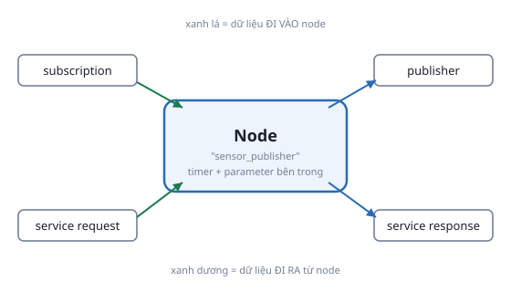

# 2. Node

*[← ROS 2 và kiến trúc DDS](01-ros2-va-dds.md) · [Mục lục module](00-gioi-thieu.md) · Tiếp theo: [Topic, Publisher/Subscriber →](03-topic-pub-sub.md)*

## Định nghĩa

**Node** là 1 tiến trình độc lập thực hiện đúng 1 nhiệm vụ, giao tiếp với node khác qua topic/service/action/parameter. Trong `rclpy`, 1 node là 1 object kế thừa `rclpy.node.Node`.



## Cơ chế

```python
import rclpy
from rclpy.node import Node

class MyNode(Node):
    def __init__(self):
        super().__init__("my_node")   # (1) tên node, PHẢI duy nhất trong hệ thống

def main(args=None):
    rclpy.init(args=args)              # (2) mở phiên ROS 2
    node = MyNode()                    # (3) tạo node
    rclpy.spin(node)                   # (4) vòng lặp chính: chờ + xử lý callback
    node.destroy_node()                # (5) dọn dẹp
    rclpy.shutdown()                   # (6) đóng phiên ROS 2
```

`rclpy.spin(node)` **chặn (block)** tại đây, xử lý sự kiện (message tới, timer tới hạn...). Thiếu dòng này — node tạo publisher/subscriber xong nhưng không xử lý được gì cả, lỗi rất hay gặp.

> 1 tiến trình có thể chứa nhiều node, nhưng **1 tiến trình = 1 node** là pattern phổ biến (dễ debug qua `ps aux`) — cũng là pattern xuyên suốt dự án Atlas.

## Ví dụ trong bài học

`src/ros2_basics/ros2_basics/sensor_publisher.py` — đúng khung 6 bước ở trên. Chạy rồi kiểm tra:
```bash
ros2 run ros2_basics sensor_publisher
ros2 node list          # /sensor_publisher
ros2 node info /sensor_publisher
```

`ros2 node info` liệt kê đúng 6 mục — mọi node đều có dạng này, chỉ khác nội dung từng mục:
- **Subscribers / Publishers** — topic node nghe/phát ([bài Topic](03-topic-pub-sub.md)).
- **Service Servers / Clients** — service node cung cấp/gọi ([bài Service](04-service.md)).
- **Action Servers / Clients** — tương tự nhưng cho action, tác vụ dài có feedback/hủy (chưa dùng tới, Module 12).

Node nào cũng có sẵn vài publisher/service dù code không khai báo dòng nào: `/parameter_events`, `/rosout` (log), và 6 service dạng `.../get_parameters`, `.../set_parameters`... — chính cơ chế đứng sau lệnh `ros2 param get/set` ([bài Parameter](05-parameter.md)). `rclpy.node.Node` tự thêm khi gọi `super().__init__(...)`, không cần tự tạo.

## Ví dụ trong dự án Atlas

- `robot_state_publisher` — node có sẵn của ROS 2, được `atlas_gazebo/launch/spawn_robot.launch.py` khởi động để publish TF từ URDF (Module 4).
- `diff_drive_controller`, `joint_state_broadcaster` — chạy bên trong tiến trình Gazebo, do plugin `gz_ros2_control` tự khởi động (Module 5).
- Nav2 (`amcl`, `controller_server`, `bt_navigator`...) — mỗi cái là 1 node riêng, khai báo tường minh trong `atlas_slam/launch/navigation.launch.py` (Module 9-10, xem trước nếu tò mò).

Atlas hoàn chỉnh có **20-30 node chạy cùng lúc** — nhiều tiến trình nhỏ giao tiếp qua message, không phải 1 chương trình lớn làm hết. Đây là lý do dễ thay/nâng cấp từng phần mà không đụng phần khác.

---
*Tiếp theo: [Topic, Publisher/Subscriber →](03-topic-pub-sub.md)*
