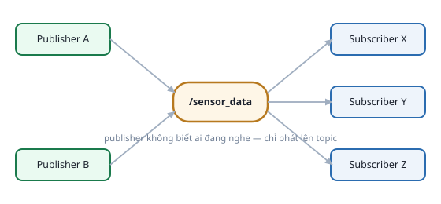
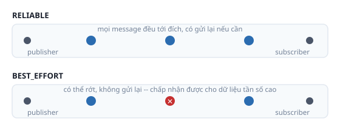

# 3. Topic, Publisher/Subscriber, QoS

*[← Node](02-node.md) · [Mục lục module](00-gioi-thieu.md) · Tiếp theo: [Service →](04-service.md)*

## Định nghĩa

**Topic** là kênh giao tiếp có tên, mang message thuộc đúng 1 kiểu, theo mô hình **publish/subscribe**: **publisher** phát message lên topic, **subscriber** nhận — publisher không biết có ai đang nghe hay không. Không giới hạn số publisher/subscriber trên 1 topic.



## Cơ chế

Kết nối publisher–subscriber dựa **hoàn toàn vào tên topic + kiểu message trùng khớp**, không quan tâm ai viết trước. Pub/sub không có khái niệm "hoàn thành" — hợp cho **luồng dữ liệu liên tục** (cảm biến, trạng thái), không hợp cho "yêu cầu 1 việc rồi cần biết kết quả" (dùng [Service](04-service.md)).

**QoS (Quality of Service)** — mỗi publisher/subscriber có 1 profile đi kèm, 2 field quan trọng nhất:
- **Reliability**: `RELIABLE` (đảm bảo tới, có gửi lại) vs `BEST_EFFORT` (có thể rớt, chấp nhận được cho dữ liệu tần số cao như LiDAR).
- **Durability**: `VOLATILE` (chỉ nhận message SAU KHI kết nối, mặc định) vs `TRANSIENT_LOCAL` (publisher giữ lại message cuối cho subscriber tới trễ — dùng cho dữ liệu "trạng thái", vd `/map`).



**Publisher và subscriber phải QoS tương thích mới kết nối được** — lệch quá thì im lặng không nhận được gì, KHÔNG có lỗi rõ ràng. Công cụ chẩn đoán:
```bash
ros2 topic info /ten_topic --verbose
```

> Xem [bài ROS 2 và kiến trúc DDS](01-ros2-va-dds.md) để hiểu vì sao publisher/subscriber tự "thấy" nhau mà không cần khởi động gì thêm.

## Ví dụ trong bài học

```python
# sensor_publisher.py
self.publisher_ = self.create_publisher(Float64, "sensor_data", 10)
self.publisher_.publish(msg)

# data_logger.py
self.subscription = self.create_subscription(Float64, "sensor_data", self.on_sensor_data, 10)
def on_sensor_data(self, msg: Float64):
    self.message_count += 1
```
```bash
ros2 run ros2_basics sensor_publisher
ros2 run ros2_basics data_logger
ros2 topic info /sensor_data --verbose   # QoS mặc định: RELIABLE + VOLATILE
ros2 topic hz /sensor_data
```

## Ví dụ trong dự án Atlas

- `/cmd_vel` — nhiều publisher (`teleop_twist_keyboard`, Nav2, `twist_mux`), 1 subscriber (`diff_drive_controller`).
- `/scan` — bridge từ Gazebo Transport sang ROS 2 qua `atlas_gazebo/config/gz_bridge.yaml`, 1 publisher, nhiều subscriber (RViz, `slam_toolbox`, costmap Nav2). Tần số cao — ứng viên tự nhiên cho `BEST_EFFORT` (Module 6).
- `/odom` — publish bởi `diff_drive_controller`, remap qua `atlas_control/urdf/atlas.control.xacro`.

---
*Tiếp theo: [Service →](04-service.md)*
