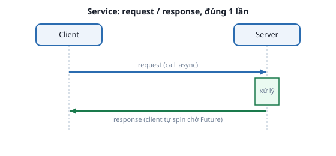

# 4. Service

*[← Topic, Publisher/Subscriber](03-topic-pub-sub.md) · [Mục lục module](00-gioi-thieu.md) · Tiếp theo: [Parameter →](05-parameter.md)*

## Định nghĩa

**Service** là mô hình **request/response**: 1 client gửi yêu cầu, 1 server xử lý rồi trả về đúng 1 phản hồi — giống gọi hàm từ xa, khác hẳn topic (không "chờ trả lời", không "1-1 cho từng lần gọi").



| | Topic | Service |
|---|---|---|
| Chiều dữ liệu | 1 chiều, liên tục | 2 chiều, request → response |
| Dùng khi | Dữ liệu chảy liên tục | Hỏi 1 câu / yêu cầu 1 việc ngắn |

## Cơ chế

Kiểu service (`.srv`) gồm Request + Response, ngăn bởi `---` — ví dụ `example_interfaces/srv/AddTwoInts`:
```
int64 a
int64 b
---
int64 sum
```

**Server** — callback nhận `request` (có dữ liệu vào), PHẢI trả về `response` đã điền (dữ liệu ra, TÍNH TỪ request):
```python
def on_add_two_ints(self, request, response):
    response.sum = request.a + request.b   # tính toán thật, không chỉ "báo cáo"
    return response
```

**Client** — bất đồng bộ, phải tự chờ:
```python
request = AddTwoInts.Request()
request.a, request.b = 3, 5
future = self.client.call_async(request)
rclpy.spin_until_future_complete(self, future)
response = future.result()   # response.sum == 8
```
`call_async()` trả về **Future** ("kết quả sẽ có sau"), khác gọi hàm Python thường. Trước khi gọi nên `client.wait_for_service(timeout_sec=...)` — service chưa có server sẽ treo/lỗi.

Gọi nhanh không cần code:
```bash
ros2 service call /ten_service <kiểu_service> "{field: value}"
```

## Ví dụ trong bài học

`add_two_ints_server.py` (server tính tổng) + `add_two_ints_client.py` (client truyền 2 số qua tham số dòng lệnh):
```bash
ros2 run ros2_basics add_two_ints_server                     # terminal 1
ros2 run ros2_basics add_two_ints_client 3 5                 # terminal 2 -> "3 + 5 = 8"
ros2 service call /add_two_ints example_interfaces/srv/AddTwoInts "{a: 10, b: 20}"   # hoặc gọi thẳng CLI
```

`data_logger.py`/`stats_client.py` ([bài Topic](03-topic-pub-sub.md)) là ví dụ khác: 1 node vừa subscribe vừa mở service (`get_stats`, dùng `std_srvs/srv/Trigger` — request RỖNG, chỉ "báo cáo" dữ liệu đã có, không tính từ input như trên).

## Ví dụ trong dự án Atlas

`atlas_slam/maps/README.md`:
```bash
ros2 service call /slam_toolbox/serialize_map slam_toolbox/srv/SerializePoseGraph \
  "{filename: '/đường/dẫn/tuyệt/đối/.../maze_map'}"
```
Đúng use-case kinh điển: "yêu cầu 1 việc xảy ra ĐÚNG 1 LẦN" (lưu bản đồ), không phải dữ liệu liên tục nên topic không hợp, đủ nhanh nên không cần action ([Parameter](05-parameter.md) nói thêm ở cuối bài).

Phần lớn node Nav2 là **lifecycle node** — dùng service để chuyển trạng thái (`configure`, `activate`), do `lifecycle_manager` tự gọi. Dòng log "Activating xxx_server" bạn thấy khi chạy Nav2 chính là 1 service call đang diễn ra.

---
*Tiếp theo: [Parameter →](05-parameter.md)*
