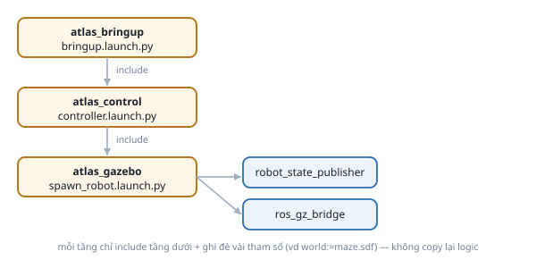

# 6. Launch file

*[← Parameter](05-parameter.md) · [Mục lục module](00-gioi-thieu.md) · Tiếp theo: [Cấu trúc package →](07-cau-truc-package.md)*

## Định nghĩa

**Launch file** (Python) mô tả danh sách việc cần làm lúc khởi động — chủ yếu "chạy node nào, với tham số/tên gì" — khởi động cả hệ thống nhiều node bằng 1 lệnh thay vì N lần `ros2 run` tay.

## Cơ chế

```python
from launch import LaunchDescription
from launch_ros.actions import Node

def generate_launch_description():
    node_a = Node(package="...", executable="...", name="...")
    return LaunchDescription([node_a])
```
`ros2 launch <package> <file>.launch.py` gọi `generate_launch_description()`, chạy mọi action trong `LaunchDescription` trả về.

**Launch argument** — tham số hóa launch file:
```python
from launch.actions import DeclareLaunchArgument
from launch.substitutions import LaunchConfiguration

rate_arg = DeclareLaunchArgument("publish_rate_hz", default_value="1.0")
node_a = Node(..., parameters=[{"publish_rate_hz": LaunchConfiguration("publish_rate_hz")}])
```
`DeclareLaunchArgument` khai báo giá trị truyền được từ CLI (`ten_arg:=gia_tri`); `LaunchConfiguration` đọc ra để gắn vào node. Đây là cách đúng để đặt parameter NGAY LÚC khởi động (khác `ros2 param set` — xem [bài Parameter](05-parameter.md)).

**`IncludeLaunchDescription`** — gọi lại 1 launch file khác, tránh 2 nơi cùng định nghĩa 1 việc:
```python
include_other = IncludeLaunchDescription(
    PythonLaunchDescriptionSource("other.launch.py"),
    launch_arguments={"world": "maze.sdf"}.items(),
)
```

## Ví dụ trong bài học

`demo.launch.py` chạy `sensor_publisher` + `data_logger` cùng lúc:
```bash
ros2 launch ros2_basics demo.launch.py
ros2 launch ros2_basics demo.launch.py publish_rate_hz:=5.0
```
So `ros2 topic hz /sensor_data` giữa 2 lần chạy — phải khác rõ rệt.

## Ví dụ trong dự án Atlas

3 tầng launch file lồng nhau, mỗi tầng chỉ thêm đúng 1 việc:



```bash
ros2 launch atlas_bringup bringup.launch.py world:=maze.sdf
```
`world:=maze.sdf` là 1 launch argument, được truyền xuyên qua 2 tầng `include` tới tận `spawn_robot.launch.py` dưới cùng.

`atlas_slam/launch/navigation.launch.py` (Module 9-10) là launch file lớn nhất dự án — khai báo tường minh ~10 `Node(...)` (map_server, amcl, planner_server...) trong 1 file, cố tình không `include` sẵn của Nav2, để thấy rõ Nav2 gồm những node nào.

---
*Tiếp theo: [Cấu trúc package →](07-cau-truc-package.md)*
