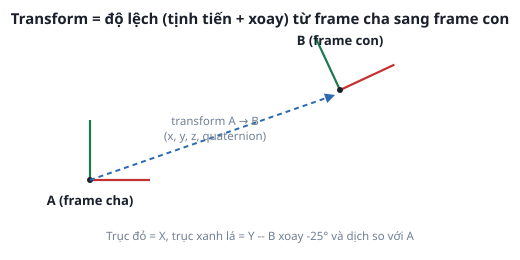

# 1. Frame và Transform

*[← Mục lục module](00-gioi-thieu.md) · Tiếp theo: [TF tree →](02-tf-tree.md)*

## Định nghĩa

**Frame** (hệ tọa độ) là 1 gốc tọa độ có tên, gắn với 1 vật/vị trí cụ thể (robot, cảm biến, điểm trên bản đồ). **Transform** là độ lệch (tịnh tiến `x,y,z` + xoay dạng quaternion) từ 1 frame CHA sang 1 frame CON — mô tả "frame con nằm ở đâu, hướng nào, NHÌN TỪ frame cha".



Mọi dữ liệu cảm biến/vị trí trong ROS 2 đều đi kèm 1 `frame_id` (xem `header.frame_id` trong bất kỳ message có `Header` nào) — 1 con số tọa độ vô nghĩa nếu không biết nó "tính từ đâu".

## Cơ chế

Transform luôn có **hướng** (cha → con) và **không đối xứng** — biết A→B suy ra được B→A (nghịch đảo), nhưng khai báo 1 transform là khai báo đúng 1 chiều. Không tự làm phép cộng/nghịch đảo ma trận tay — `tf2` làm việc đó, bạn chỉ cần **publish transform mình biết** (qua `TransformBroadcaster`) và **hỏi transform mình cần** (qua `TransformListener` + `Buffer.lookup_transform()`), kể cả khi 2 frame không nối trực tiếp mà phải đi qua nhiều frame trung gian.

## Ví dụ trong bài học

`tf_broadcaster.py` publish 1 transform ĐỘNG `world → moving_frame` (frame con tự xoay tròn quanh gốc):
```python
t = TransformStamped()
t.header.frame_id = "world"
t.child_frame_id = "moving_frame"
t.transform.translation.x = radius * math.cos(angle)
t.transform.translation.y = radius * math.sin(angle)
t.transform.rotation.z = math.sin(angle / 2.0)   # quaternion cho xoay quanh trục Z
t.transform.rotation.w = math.cos(angle / 2.0)
self.broadcaster.sendTransform(t)
```
`tf_listener.py` hỏi lại transform đó, không cần biết bên kia publish thế nào:
```python
t = self.buffer.lookup_transform("world", "moving_frame", rclpy.time.Time())
```
Chạy thử:
```bash
ros2 launch ros2_basics demo_tf.launch.py     # terminal 1
ros2 run ros2_basics tf_listener               # terminal 2
```

## Ví dụ trong dự án Atlas

`atlas_description/urdf/atlas.urdf.xacro` — mỗi `<joint>` giữa 2 `<link>` (Module 3) chính là khai báo 1 transform tĩnh cha→con (vd `base_link` → `lidar_link`, lệch đúng vị trí gắn LiDAR thật trên khung robot). Bạn sẽ không tự gọi `TransformBroadcaster` cho các frame này — `robot_state_publisher` tự đọc URDF và publish hết.

---
*Tiếp theo: [TF tree →](02-tf-tree.md)*
