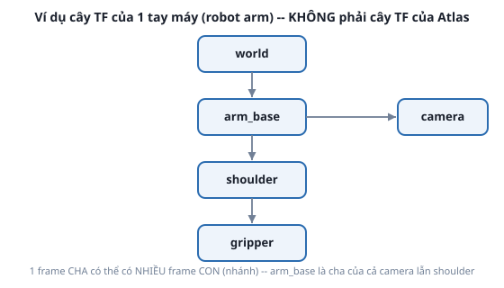

# 2. TF tree

*[← Frame và Transform](01-frame-va-transform.md) · [Mục lục module](00-gioi-thieu.md) · Tiếp theo: [REP-103/REP-105 →](03-rep103-rep105.md)*

## Định nghĩa

**TF tree** là tập hợp mọi transform trong hệ thống, ghép lại thành 1 **cây** (không phải đồ thị tùy ý): mỗi frame có **đúng 1 frame cha** (trừ frame gốc), nhưng có thể có **nhiều frame con**.



## Cơ chế

Ràng buộc "đúng 1 cha" không phải giới hạn kỹ thuật — đó là điều làm TF **luôn giải được**: muốn biết transform giữa 2 frame bất kỳ (kể cả không nối trực tiếp), chỉ cần đi ngược lên tổ tiên chung rồi ghép các transform lại — `tf2` tự làm việc này trong `lookup_transform()`. Khai báo 2 frame cha cho cùng 1 frame con sẽ phá vỡ tính chất này — TF báo lỗi hoặc kết quả không xác định.

Bên dưới, TF **chỉ là topic** `/tf` (động, `TFMessage`) và `/tf_static` (tĩnh, publish 1 lần với QoS `TRANSIENT_LOCAL` — subscriber tới trễ vẫn nhận được, xem lại [QoS ở Module 1](../module-01-ros2-core-concepts/03-topic-pub-sub.md)) — không có gì đặc biệt ngoài pub/sub đã học, chỉ là `tf2_ros` tự gộp nhiều message từ nhiều node lại thành 1 cây hoàn chỉnh trong bộ nhớ (`Buffer`), có nội suy theo thời gian.

## Ví dụ trong bài học

`demo_tf.launch.py` dựng cây 3 frame: `world` → `static_frame` (tĩnh) + `world` → `moving_frame` (động) — đúng minh họa "1 cha, nhiều con".
```bash
ros2 launch ros2_basics demo_tf.launch.py
ros2 run tf2_tools view_frames        # xuất frames_<timestamp>.pdf, vẽ cây thật
```

## Ví dụ trong dự án Atlas

Atlas hoàn chỉnh (Module 3 trở đi) có TF tree với gốc `map`, nhánh qua `odom` → `base_link`, rồi từ `base_link` tỏa ra nhiều frame con (bánh xe, caster, cảm biến — xem [bài tập](05-bai-tap.md), cố tình chưa vẽ ở đây). Khi Nav2 chạy (Module 9-10) còn có thêm nhánh `base_link` → `local_costmap`... — cây TF thật của 1 robot hoàn chỉnh dễ có 10+ frame.

Lệnh sẽ dùng lại xuyên suốt các module sau để debug TF của Atlas:
```bash
ros2 run tf2_tools view_frames
ros2 run tf2_ros tf2_echo <frame_cha> <frame_con>
```

---
*Tiếp theo: [REP-103/REP-105 →](03-rep103-rep105.md)*
