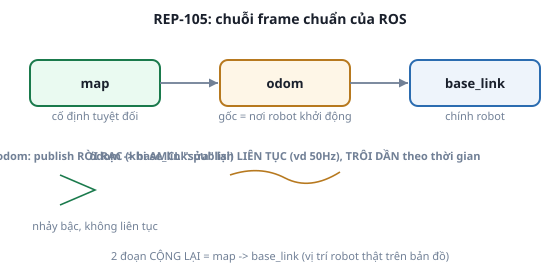

# 3. REP-103 & REP-105 — quy ước chuẩn của ROS

*[← TF tree](02-tf-tree.md) · [Mục lục module](00-gioi-thieu.md) · Tiếp theo: [Công cụ debug →](04-cong-cu-debug.md)*

## Định nghĩa

**REP** (ROS Enhancement Proposal) là tài liệu quy ước chính thức của ROS. **REP-103** quy định đơn vị + chiều trục. **REP-105** quy định tên và quan hệ của các frame chuẩn mà mọi package ROS (Nav2, `robot_state_publisher`, `slam_toolbox`...) đều giả định có sẵn — không tuân theo là mọi thứ vẫn "chạy" nhưng phối hợp sai mà rất khó phát hiện.

## Cơ chế

**REP-103**: đơn vị luôn là mét/giây/radian (không phải cm, không phải độ); chiều trục theo quy tắc bàn tay phải — X hướng **tới trước**, Y hướng **sang trái**, Z hướng **lên trên**. Quaternion `(0,0,0,1)` là "không xoay".

**REP-105** — chuỗi frame chuẩn: `map` → `odom` → `base_link`.



- **`map`**: cố định tuyệt đối theo thời gian, gốc tại 1 điểm trên bản đồ. Transform `map`→`odom` publish **rời rạc, nhảy bậc** — mỗi khi AMCL/SLAM "sửa" lại ước lượng vị trí toàn cục.
- **`odom`**: gốc là nơi robot khởi động, KHÔNG BAO GIỜ nhảy — transform `odom`→`base_link` publish **liên tục, mượt** (vd 50Hz, tính từ encoder bánh xe) nhưng **trôi dần** theo thời gian (sai số cộng dồn, không có gì "sửa" nó).
- **`base_link`**: gắn cứng vào chính robot.

**Vì sao tách riêng thay vì gộp 1 frame `map`→`base_link` duy nhất**: bộ điều khiển vận động (local controller, Module 10) cần dữ liệu **mượt, không nhảy** để tính lệnh vận tốc — nếu dùng thẳng `map`→`base_link` (có thể nhảy bậc mỗi lần AMCL sửa), robot sẽ giật cục theo mỗi lần sửa lỗi định vị. Tách `odom` ra làm frame trung gian **luôn mượt** để điều khiển local dùng, còn `map`→`odom` chỉ ảnh hưởng tới hiểu biết "toàn cục" (global planning), không ảnh hưởng chuyển động tức thời.

## Ví dụ trong bài học

```bash
ros2 run ros2_basics tf_broadcaster
ros2 run tf2_ros tf2_echo world moving_frame
```
Kiểm tra đơn vị: `Translation` in mét, `Rotation (RPY)` in radian — đúng REP-103, không phải cm/độ.

## Ví dụ trong dự án Atlas

- `diff_drive_controller` (Module 5) tự publish `odom` → `base_footprint` liên tục từ encoder bánh xe — dữ liệu này **trôi dần** theo quãng đường đi (đã tự kiểm chứng: lệch dần nếu không có AMCL sửa).
- `amcl` (Module 9) publish `map` → `odom` — chỉ cập nhật khi có ước lượng mới, KHÔNG publish liên tục như `odom`→`base_link`. Đúng lý do `nav2_costmap_2d` cấu hình `local_costmap` dùng `global_frame: odom` (cần mượt) còn `global_costmap` dùng `global_frame: map` (cần đúng vị trí tuyệt đối) — 2 lựa chọn khác nhau, không phải ngẫu nhiên.

---
*Tiếp theo: [Công cụ debug →](04-cong-cu-debug.md)*
