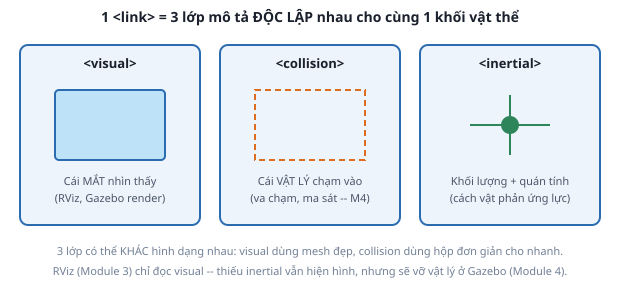

# 2. Link — visual, collision, inertial

*[← URDF là gì](01-urdf-la-gi.md) · [Mục lục module](00-gioi-thieu.md) · Tiếp theo: [Joint →](03-joint.md)*

## Định nghĩa

**`<link>`** là 1 khối cứng (rigid body) của robot: khung, bánh xe, vỏ cảm biến. Mỗi link mang tối đa 3 phần mô tả **độc lập** cho cùng khối đó.



## Cơ chế

- **`<visual>`** — hình để *nhìn*. RViz và Gazebo render cái này. Có thể là `<box>`, `<cylinder>`, `<sphere>` hoặc `<mesh>` (file `.dae`/`.stl` từ CAD).
- **`<collision>`** — hình để *va chạm*. Bộ giải vật lý (Module 4) chỉ dùng cái này. Thường cố tình làm **đơn giản hơn** visual: mesh 50 000 tam giác render thì mượt nhưng tính va chạm thì chậm và hay kẹt, nên thay bằng 1 hộp bao.
- **`<inertial>`** — *khối lượng* + **ma trận quán tính** (inertia tensor): vật nặng bao nhiêu và "khó xoay" quanh mỗi trục cỡ nào. Không ảnh hưởng gì ở Module 3, nhưng sai ở đây là robot nảy tung/rơi xuyên sàn ở Module 4.

Mỗi phần có `<origin xyz rpy>` riêng — độ lệch của hình khối đó so với **gốc của link**. Đây là chỗ người mới hay nhầm: gốc link không nhất thiết nằm giữa khối hình học.

Về inertia: không cần tự đạo hàm. Với hình cơ bản có công thức sẵn — hộp `ixx = (1/12)·m·(y²+z²)`, trụ đặc `izz = (1/2)·m·r²`, cầu đặc `ixx = (2/5)·m·r²`. Viết một lần thành macro rồi dùng lại (xem [bài 4](04-xacro.md)).

## Ví dụ trong dự án Atlas

`base_link` (trong `atlas.urdf.xacro`) — cả 3 phần dùng chung 1 `<origin>` nâng hộp lên nửa chiều cao, để gốc link nằm ở **đáy** khung chứ không phải giữa khung:

```xml
<link name="base_link">
  <visual>
    <origin xyz="0 0 ${base_height / 2}" rpy="0 0 0"/>
    <geometry><box size="${base_length} ${base_width} ${base_height}"/></geometry>
    <material name="atlas_white"/>
  </visual>
  <collision>
    <origin xyz="0 0 ${base_height / 2}" rpy="0 0 0"/>
    <geometry><box size="${base_length} ${base_width} ${base_height}"/></geometry>
  </collision>
  <xacro:inertial_box mass="${base_mass}" x="${base_length}" y="${base_width}" z="${base_height}">
    <origin xyz="0 0 ${base_height / 2}" rpy="0 0 0"/>
  </xacro:inertial_box>
</link>
```

Hai link đặc biệt cần chú ý:

- **`base_footprint`** — `<link name="base_footprint"/>`, rỗng hoàn toàn: không visual, không collision, không khối lượng. Đây là **link ảo** đánh dấu hình chiếu của robot xuống mặt đất. Nav2/AMCL (Module 9-10) trông đợi có một frame chạm đất như vậy.
- **`lidar_link`** — visual là trụ tròn đen, nhưng đó chỉ là *vỏ hộp* LiDAR. Việc nó phát ra tia quét là chuyện của plugin trong `atlas_gazebo` (Module 6), không phải của link này.

Atlas dùng hình khối cơ bản (`box`, `cylinder`, `sphere`) cho cả visual lẫn collision, không dùng mesh — thư mục `meshes/` để trống cố ý: mục tiêu khóa học là dạy ROS 2/Nav2, không phải mỹ thuật 3D.

## Thử ngay

```bash
ros2 launch atlas_description display.launch.py
```
Trong RViz, panel **Displays** → `RobotModel`:
- Bật/tắt **Visual Enabled** và **Collision Enabled** để so 2 lớp — với Atlas chúng trùng nhau, nên hãy thử thay `${base_length}` bằng `0.6` trong riêng khối `<collision>` của `base_link` rồi build lại, sẽ thấy hộp va chạm to hơn hộp nhìn thấy.
- Thử xóa hẳn khối `<visual>` của `imu_link` → robot vẫn chạy, chỉ là khối cam biến mất. Xóa `<inertial>` → RViz vẫn bình thường, nhưng nhớ lại điều này ở Module 4.

---
*Tiếp theo: [Joint →](03-joint.md)*
