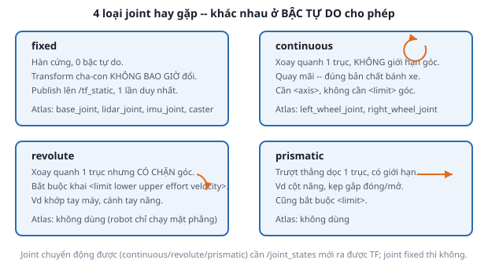

# 3. Joint — nối các link lại

*[← Link](02-link.md) · [Mục lục module](00-gioi-thieu.md) · Tiếp theo: [XACRO →](04-xacro.md)*

## Định nghĩa

**`<joint>`** khai báo quan hệ giữa **đúng 2 link**: 1 `<parent>`, 1 `<child>`, cộng với `<origin>` — vị trí/hướng của link con so với link cha. Loại joint (`type`) quyết định quan hệ đó có được phép **thay đổi theo thời gian** hay không.



## Cơ chế

```xml
<joint name="left_wheel_joint" type="continuous">
  <parent link="base_link"/>
  <child link="left_wheel_link"/>
  <origin xyz="0 0.15 0" rpy="0 0 0"/>   <!-- bánh nằm lệch 15cm sang TRÁI -->
  <axis xyz="0 1 0"/>                     <!-- quay quanh trục Y -->
</joint>
```

Ba điều dễ sai nhất:

1. **`<origin>` đặt ở joint, không phải ở link.** Link chỉ mô tả hình dạng tại gốc của chính nó; việc "đặt link đó ở đâu trên robot" hoàn toàn do joint quyết định. Muốn dời LiDAR ra trước 5cm → sửa `<origin>` của `lidar_joint`, không sửa `lidar_link`.
2. **`rpy` tính bằng radian**, theo REP-103 ([Module 2](../module-02-tf2-toa-do/03-rep103-rep105.md)): x tới trước, y sang trái, z lên trên. Dùng `${pi/2}` chứ đừng viết `1.5708`.
3. **`<axis>` là trục quay tính trong hệ tọa độ của link CON**, sau khi đã áp dụng `rpy` của `<origin>`.

`<limit>` bắt buộc với `revolute`/`prismatic` (`lower`, `upper` = giới hạn vị trí; `effort` = lực/mô-men tối đa; `velocity` = tốc độ tối đa), và không dùng cho `continuous`/`fixed`.

## Ví dụ trong dự án Atlas

7 joint của Atlas, xem trong `atlas.urdf.xacro` + `wheel.xacro` + `sensors.xacro`:

| Joint | Type | Vì sao chọn type đó |
|---|---|---|
| `base_joint` | fixed | `base_footprint` → `base_link`, nâng đúng `wheel_radius` cho đế chạm đất |
| `left_wheel_joint`, `right_wheel_joint` | **continuous** | bánh xe quay không giới hạn góc |
| `front_caster_joint`, `rear_caster_joint` | fixed | đơn giản hóa bánh bi cầu — xem dưới |
| `lidar_joint`, `imu_joint` | fixed | cảm biến hàn cứng lên khung |

Hai mẹo thiết kế đáng học trong `wheel.xacro`:

**Bánh xe đặt đúng `x=0`.** `<origin xyz="0 ${reflect * wheel_separation / 2} 0"/>` — thành phần x bằng 0, nghĩa là trục 2 bánh đi qua tâm `base_link`. `diff_drive_controller` (Module 5) giả định tâm quay tức thời của robot trùng gốc `base_link`; dời trục bánh ra trước/sau sẽ làm odometry trôi dần mỗi lần robot xoay tại chỗ, kéo theo SLAM và Nav2 sai.

**Caster dùng joint `fixed`, không phải joint quay.** Bánh bi cầu tự do mọi hướng không mô hình hóa được gọn bằng URDF (cần nhiều bậc tự do), nên cách phổ biến là hàn cứng quả cầu vào khung rồi **đặt ma sát ≈ 0** ở phần Gazebo (Module 4) để nó trượt tự do. Giả lập hành vi bằng ma sát, không bằng cơ khí.

**Vì sao 2 caster chứ không 1:** trục bánh chủ động nằm ở `x=0` tức chính giữa robot, mà trọng tâm cũng gần đó — chỉ 1 caster (giả sử phía sau) thì nửa thân trước không có điểm tựa, robot chúi mũi khi tăng tốc. Có caster cả trước lẫn sau thì trọng tâm luôn nằm gọn trong đa giác điểm tựa.

## Thử ngay

```bash
ros2 launch atlas_description display.launch.py
```
1. Kéo slider `left_wheel_joint` trong cửa sổ GUI → chỉ bánh trái quay. Đó là joint `continuous` đang hoạt động.
2. Đổi `<axis xyz="0 1 0"/>` thành `<axis xyz="0 0 1"/>` trong `wheel.xacro`, build lại → kéo slider, bánh xe sẽ quay như mâm xoay thay vì lăn. Sai `axis` trông y hệt lỗi cơ khí nhưng chỉ là 1 dòng XML.
3. Đổi `left_wheel_joint` thành `type="fixed"`, build lại → slider biến mất khỏi GUI và bánh không quay được nữa. Joint `fixed` không có bậc tự do nên không xuất hiện trong `/joint_states` ([bài 5](05-robot-state-publisher.md)).

Nhớ `git checkout` lại các file sau khi thử.

---
*Tiếp theo: [XACRO →](04-xacro.md)*
