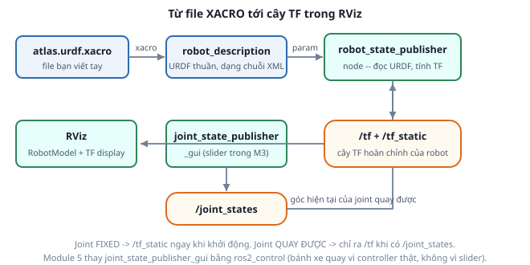

# 5. Từ URDF ra TF: robot_state_publisher

*[← XACRO](04-xacro.md) · [Mục lục module](00-gioi-thieu.md) · Tiếp theo: [Đọc URDF Atlas →](06-doc-urdf-atlas.md)*

## Định nghĩa

**`robot_state_publisher`** là node đọc URDF (qua parameter `robot_description`) và **publish toàn bộ cây TF của robot**. Đây là mắt xích biến file XML tĩnh thành dữ liệu sống trong hệ thống ROS 2.



## Cơ chế

`robot_state_publisher` chia joint làm 2 nhóm:

- **Joint `fixed`** — transform không bao giờ đổi → tính 1 lần, publish lên `/tf_static` với QoS `TRANSIENT_LOCAL` ([Module 2](../module-02-tf2-toa-do/02-tf-tree.md)), node khởi động trễ vẫn nhận được.
- **Joint chuyển động được** (`continuous`/`revolute`/`prismatic`) — transform phụ thuộc góc khớp **hiện tại**, nên `robot_state_publisher` phải được *cho biết* góc đó: nó subscribe `/joint_states` (`sensor_msgs/JointState`) và mỗi lần nhận message thì tính lại transform rồi publish lên `/tf`.

Nói cách khác: `robot_state_publisher` biết **hình học**, không biết **trạng thái**. Ai cấp `/joint_states` là tùy ngữ cảnh:

| Ngữ cảnh | Nguồn `/joint_states` |
|---|---|
| Module 3 (chỉ xem hình) | `joint_state_publisher_gui` — slider kéo tay |
| Module 5 trở đi (mô phỏng) | `joint_state_broadcaster` của `ros2_control` — góc bánh xe thật trong Gazebo |
| Robot thật | driver đọc encoder |

Cả 3 trường hợp, `robot_state_publisher` và URDF **không đổi một dòng nào** — đó chính là lợi ích của việc tách hình học khỏi trạng thái.

Truyền URDF vào node bằng `Command(["xacro ", <đường dẫn>])` trong launch file: xacro được chạy **lúc launch**, kết quả nạp thẳng vào parameter, không cần sinh file `.urdf` trung gian.

## Ví dụ trong dự án Atlas

`atlas_description/launch/display.launch.py` dựng đúng 3 node của sơ đồ trên:

```python
robot_description = ParameterValue(
    Command(["xacro ", LaunchConfiguration("model")]), value_type=str
)

robot_state_publisher_node = Node(
    package="robot_state_publisher", executable="robot_state_publisher",
    parameters=[{"robot_description": robot_description}],
)
joint_state_publisher_gui_node = Node(
    package="joint_state_publisher_gui", executable="joint_state_publisher_gui",
    condition=IfCondition(LaunchConfiguration("use_joint_state_gui")),
)
rviz_node = Node(package="rviz2", executable="rviz2",
                 arguments=["-d", default_rviz_path])
```

`value_type=str` là chi tiết bắt buộc: thiếu nó, launch cố đoán kiểu và có thể parse chuỗi XML thành kiểu khác, dẫn tới `robot_description` rỗng (RViz báo "No robot model"). Cấu hình RViz lưu sẵn tại `rviz/atlas_view.rviz` để học viên mở lên là có đủ RobotModel + TF display, không phải thêm tay.

`use_joint_state_gui` để `false` khi chạy cùng Gazebo (Module 4-5): lúc đó `/joint_states` đến từ mô phỏng, hai nguồn cùng publish một topic sẽ đánh nhau và bánh xe giật.

## Thử ngay

```bash
ros2 launch atlas_description display.launch.py
```
Mở terminal khác, kiểm tra từng mắt xích trong sơ đồ:
```bash
ros2 param get /robot_state_publisher robot_description | head -5   # URDF đã vào chưa
ros2 topic echo /joint_states --once                                # GUI đang phát gì
ros2 run tf2_tools view_frames                                      # cây TF thật -- so với check_urdf ở bài 1
ros2 run tf2_ros tf2_echo base_link lidar_link                      # fixed: số KHÔNG đổi
ros2 run tf2_ros tf2_echo base_link left_wheel_link                 # continuous: kéo slider, số ĐỔI
```

Bài thử quan trọng nhất: **tắt `joint_state_publisher_gui`**
```bash
ros2 launch atlas_description display.launch.py use_joint_state_gui:=false
```
RViz báo lỗi TF, bánh xe không hiện đúng chỗ — vì không ai cấp `/joint_states` nên `robot_state_publisher` không tính nổi transform tới 2 bánh, trong khi các frame `fixed` (LiDAR, IMU, caster) vẫn bình thường. Nhận ra được triệu chứng này sẽ tiết kiệm rất nhiều thời gian ở Module 5 và Module 8.

---
*Tiếp theo: [Đọc URDF Atlas →](06-doc-urdf-atlas.md)*
