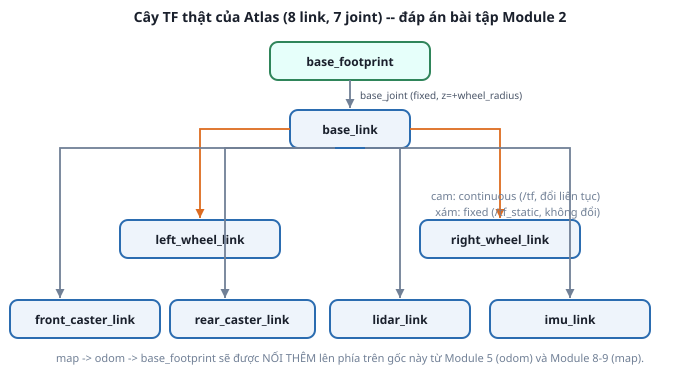

# 6. Đọc trọn URDF của Atlas

*[← robot_state_publisher](05-robot-state-publisher.md) · [Mục lục module](00-gioi-thieu.md) · Tiếp theo: [Bài tập →](07-bai-tap.md)*

## Định nghĩa

Bài này ghép mọi thứ đã học lại: đọc `atlas_description` từ đầu đến cuối như đọc code người khác viết — không chỉ *cái gì*, mà **vì sao lại làm thế**. Đây cũng là phần dùng được trực tiếp trong báo cáo đồ án.



## Cơ chế — thứ tự trải file

```
atlas.urdf.xacro
├── include materials.xacro        → 4 material màu
├── include inertial_macros.xacro  → 3 macro inertia
├── include wheel.xacro            → macro atlas_wheel, atlas_caster
├── include sensors.xacro          → macro atlas_sensors
├── <xacro:property> × 15          → toàn bộ kích thước/khối lượng
├── link base_footprint (rỗng) + base_joint (fixed)
├── link base_link (hộp)
├── gọi atlas_wheel  × 2  (left/right)
├── gọi atlas_caster × 2  (front/rear)
└── gọi atlas_sensors     (lidar_link + imu_link)
```
4 file include đứng **trước** khối property, và không file nào sinh link trực tiếp — tất cả đều bọc trong macro, đúng lý do đã nói ở [bài 4](04-xacro.md).

## Ví dụ trong dự án Atlas — 5 quyết định thiết kế

**1. Vì sao có `base_footprint` mà không chỉ dùng `base_link`?**
`base_link` đặt ngang trục bánh xe (cao `wheel_radius` so với mặt đất) — thuận cho động học vi sai. Nhưng Nav2 và costmap (Module 10) suy luận theo *hình chiếu robot xuống sàn*. Tách thêm 1 link ảo chạm đất giúp cả 2 nhu cầu cùng đúng, mà không phải chọn một cái sai:
```xml
<link name="base_footprint"/>
<joint name="base_joint" type="fixed">
  <parent link="base_footprint"/><child link="base_link"/>
  <origin xyz="0 0 ${wheel_radius}" rpy="0 0 0"/>
</joint>
```

**2. Vì sao bánh trái/phải chỉ khác nhau một tham số `reflect`?**
`<origin xyz="0 ${reflect * wheel_separation / 2} 0"/>` với `reflect=1` (trái) và `-1` (phải). Theo REP-103, **+y là bên trái** — nhớ quy ước này thì không bao giờ lắp ngược bánh. Lắp ngược thì robot vẫn chạy, chỉ là quay trái khi bạn bảo nó quay phải: lỗi rất khó tìm nếu không nhớ REP-103.

**3. Vì sao LiDAR lệch về phía trước `lidar_x_offset = 0.05`?**
Đặt đúng tâm thì thân robot/dây nối che một phần góc quét. Đẩy ra trước một chút để vùng quét phía trước (hướng robot di chuyển) sạch. Chiều cao `${base_height + lidar_height / 2}` là ngồi đúng trên nóc, tự khớp lại nếu sau này đổi `base_height`.

**4. Vì sao IMU đặt sát tâm robot?**
`<origin xyz="0 0 ${imu_size / 2}"/>` — gần trục quay. IMU đặt xa tâm sẽ đo thêm gia tốc hướng tâm do cánh tay đòn mỗi khi robot xoay, thành nhiễu cho bộ lọc sau này.

**5. Vì sao `atlas_description` không chứa gì liên quan Gazebo?**
Đây là quyết định kiến trúc quan trọng nhất của module. Mô tả robot được xếp **3 lớp**, mỗi lớp include lớp dưới:

| Package | File | Thêm gì | Module |
|---|---|---|---|
| `atlas_description` | `atlas.urdf.xacro` | hình học + TF thuần (không phụ thuộc simulator) | 3 |
| `atlas_gazebo` | `atlas.gazebo.xacro` | `<gazebo>`: ma sát, plugin LiDAR/IMU | 4, 6 |
| `atlas_control` | `atlas.control.xacro` | `<ros2_control>` + plugin `gz_ros2_control` | 5 |

```xml
<!-- atlas_gazebo/urdf/atlas.gazebo.xacro -->
<xacro:include filename="$(find atlas_description)/urdf/atlas.urdf.xacro"/>
<gazebo reference="left_wheel_link"><mu1>1.0</mu1><mu2>1.0</mu2></gazebo>
<gazebo reference="front_caster_link"><mu1>0.0</mu1><mu2>0.0</mu2></gazebo>
```
Đúng chỗ này thấy rõ caster `fixed` ([bài 3](03-joint.md)) hoạt động ra sao: bánh chủ động ma sát `1.0` để bám, caster ma sát `0.0` để trượt tự do mọi hướng — thay cho bậc tự do cơ khí.

Giá trị thật của 3 lớp: chuyển sang robot thật chỉ cần thay lớp trên cùng (`<hardware><plugin>` trỏ driver thật thay vì `GazeboSimSystem`), hai lớp dưới giữ nguyên. Và ngược lại, sửa kích thước bánh xe ở lớp dưới thì Gazebo lẫn controller tự nhận.

## Thử ngay

```bash
# 3 lớp cho ra 3 URDF khác nhau từ cùng một mô tả robot
xacro src/atlas_description/urdf/atlas.urdf.xacro | wc -l
xacro src/atlas_gazebo/urdf/atlas.gazebo.xacro   | wc -l   # nhiều hơn: có <gazebo>
xacro src/atlas_control/urdf/atlas.control.xacro | wc -l   # nhiều nhất: thêm <ros2_control>

# Xem cây TF Atlas so với hình ở đầu bài
ros2 launch atlas_description display.launch.py
ros2 run tf2_tools view_frames
```

Đọc lại cây TF bạn tự vẽ ở [bài tập Module 2](../module-02-tf2-toa-do/05-bai-tap.md) và đối chiếu. Hai chỗ hầu hết mọi người đoán thiếu: `base_footprint` (không có trong đề bài) và **2** caster thay vì 1. Hiểu được vì sao thiếu chúng thì quan trọng hơn việc đoán đúng.

---
*Tiếp theo: [Bài tập →](07-bai-tap.md)*
