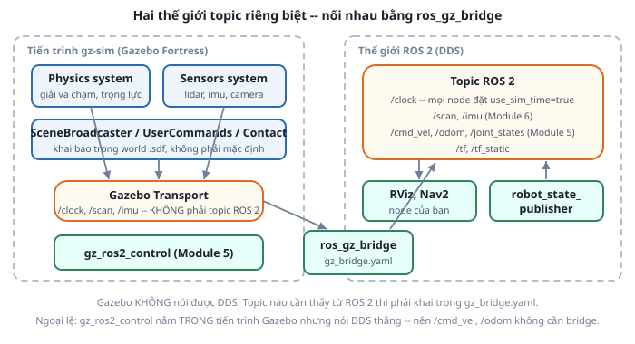

# 1. Gazebo là gì — và là Gazebo nào?

*[← Mục lục module](00-gioi-thieu.md) · Tiếp theo: [Vật lý & inertia →](02-vat-ly-inertia.md)*

## Định nghĩa

**Gazebo** là bộ mô phỏng robot: nó giải phương trình vật lý (trọng lực, va chạm, ma sát), render hình ảnh, và mô phỏng cảm biến sinh ra dữ liệu như thật. Có **hai dòng Gazebo hoàn toàn khác nhau** cùng tên, và nhầm lẫn giữa chúng là nguyên nhân số 1 khiến tutorial trên mạng không chạy được:

| | **Gazebo Classic** | **gz-sim** (Gazebo mới) |
|---|---|---|
| Phiên bản cuối/hiện hành | Gazebo 11 — **EOL 1/2025** | Fortress, Garden, **Harmonic** |
| Đi với ROS 2 | Foxy (di sản từ ROS 1) | **Humble → Fortress**, Jazzy → Harmonic |
| Package ROS | `gazebo_ros_pkgs`, `ros-humble-gazebo-*` | `ros_gz`, **`ros-humble-ros-gz`** |
| Plugin trong URDF | `libgazebo_ros_diff_drive.so`… | hệ thống plugin mới, `<sensor>` chuẩn SDF |
| Truyền tin | trực tiếp trong tiến trình | **Gazebo Transport** + `ros_gz_bridge` |

Khóa học này dùng **Gazebo Fortress** — bản gz-sim ghép với Humble theo REP-2000. Thấy tutorial nào dùng `libgazebo_ros_*.so` hay cài `ros-humble-gazebo-ros-pkgs` thì đó là Classic, **không áp dụng được** cho repo này.

## Cơ chế

Điểm khác biệt kiến trúc quan trọng nhất: gz-sim là một **chương trình độc lập**, không biết gì về ROS 2. Nó có hệ truyền tin riêng — **Gazebo Transport** — với topic riêng, kiểu message riêng (`gz.msgs.*`), không phải DDS.



Hệ quả thực tế: `ros2 topic list` **không** thấy topic của Gazebo, trừ khi topic đó được khai báo trong `ros_gz_bridge` ([bài 5](05-ros-gz-bridge.md)). Đây là khác biệt lớn nhất so với Gazebo Classic, nơi plugin publish thẳng ra topic ROS.

Bản thân gz-sim là một bộ khung rỗng: mọi năng lực đều là **system plugin** khai báo trong world file — không có `gz-sim-physics-system` thì world không có trọng lực, không có `gz-sim-sensors-system` thì LiDAR không phát dữ liệu ([bài 3](03-world-file.md)).

## Ví dụ trong dự án Atlas

`atlas_gazebo` chỉ thêm phần Gazebo lên trên URDF đã có, đúng kiến trúc 3 lớp của [Module 3](../module-03-urdf-xacro/06-doc-urdf-atlas.md):

```xml
<!-- atlas_gazebo/urdf/atlas.gazebo.xacro -->
<xacro:include filename="$(find atlas_description)/urdf/atlas.urdf.xacro"/>

<gazebo reference="left_wheel_link">
  <mu1>1.0</mu1><mu2>1.0</mu2>
</gazebo>
```

Tag `<gazebo reference="...">` là cách gắn thuộc tính mô phỏng vào một link đã khai báo trong URDF. `sdformat` — bộ chuyển URDF → SDF mà gz-sim dùng — đọc các tag này khi nạp robot. Cú pháp này giữ nguyên từ thời Classic, nên dễ nhầm; điều **đã đổi** là nội dung bên trong: không còn `<plugin filename="libgazebo_ros_*.so">`, mà dùng thẻ `<sensor>` chuẩn SDF (xem Module 6).

`package.xml` của `atlas_gazebo` khai `ros_gz_sim` và `ros_gz_bridge`, **không** khai `gazebo_ros` — đọc file dependency là biết ngay dự án đang dùng Gazebo nào.

## Thử ngay

```bash
# Kiểm tra máy đang có bản nào -- Fortress thì gói tên ignition-*
apt list --installed 2>/dev/null | grep -i "ignition\|gz-sim\|gazebo" | head

ros2 launch atlas_gazebo spawn_robot.launch.py
```

Mở terminal thứ hai, tự chứng minh "hai thế giới":
```bash
gz topic -l        # danh sách topic Gazebo Transport (nhiều, có /world/atlas_empty/...)
ros2 topic list    # danh sách topic ROS 2 -- ít hơn hẳn, chỉ có thứ đã bridge
```
Hai danh sách khác nhau chính là điều bài 5 sẽ giải quyết.

> **Ghi chú CLI**: Fortress ra đời trước đợt đổi tên `ign` → `gz`, nên tùy cách cài mà bộ lệnh dòng lệnh là `ign gazebo` / `ign topic` / `ign model` hoặc `gz sim` / `gz topic` / `gz model` (Garden/Harmonic trở đi chỉ còn tiền tố `gz`). Các bài sau viết theo dạng `gz ...`; máy bạn báo `command not found` thì thay bằng `ign ...`, tham số giữ nguyên. Việc mở Gazebo thì ta luôn làm qua `ros2 launch` nên không bị ảnh hưởng.

---
*Tiếp theo: [Vật lý & inertia →](02-vat-ly-inertia.md)*
