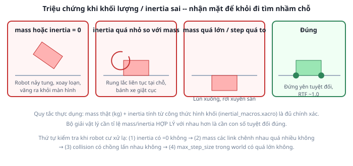

# 2. Vật lý: khối lượng, inertia, ma sát

*[← Gazebo là gì](01-gazebo-la-gi.md) · [Mục lục module](00-gioi-thieu.md) · Tiếp theo: [World file →](03-world-file.md)*

## Định nghĩa

Bộ giải vật lý cần đúng 3 thứ từ mỗi link để mô phỏng: **`<collision>`** (hình dạng chạm nhau), **`<inertial>`** (khối lượng + ma trận quán tính), và **thuộc tính bề mặt** (ma sát `mu1`/`mu2`, khai trong tag `<gazebo>`). Ở [Module 3](../module-03-urdf-xacro/02-link.md) ba thứ này chỉ là XML không gây hậu quả gì; từ module này chúng quyết định robot đứng hay lật.

## Cơ chế

**Ma trận quán tính (inertia tensor)** trả lời: "khó xoay vật này quanh mỗi trục cỡ nào". Khối lượng chống lại việc *đẩy*, inertia chống lại việc *xoay*. Robot không có inertia hợp lý sẽ phản ứng với lực nhỏ nhất bằng tốc độ xoay vô hạn — đó chính là hiện tượng "robot nổ tung" kinh điển.



Điểm mấu chốt: bộ giải cần **tỉ lệ hợp lý giữa mass và inertia**, hơn là con số tuyệt đối chính xác. Dùng công thức hình khối cơ bản là đủ tốt cho mô phỏng học tập.

**Ma sát `mu1`/`mu2`** — hệ số ma sát theo 2 hướng tiếp tuyến tại điểm tiếp xúc. Với bánh xe: `mu` cao thì bánh bám sàn, quay là robot tiến; `mu` = 0 thì bánh quay tít mà robot đứng im. Đây là cách mô phỏng hành vi cơ khí bằng tham số bề mặt thay vì bằng cấu trúc khớp.

**`max_step_size`** trong world — bước thời gian của bộ giải. Bước càng nhỏ càng chính xác nhưng càng chậm. Bước quá lớn thì vật thể di chuyển quá xa trong 1 bước và "nhảy xuyên" qua sàn trước khi va chạm kịp được phát hiện.

## Ví dụ trong dự án Atlas

Khối lượng chọn theo robot thật cỡ nhỏ, không phải số cho có (`atlas.urdf.xacro`):

| Link | mass (kg) | Vì sao |
|---|---|---|
| `base_link` | 5.0 | Thân robot, chiếm gần hết khối lượng |
| mỗi bánh | 0.3 | Nhẹ so với thân — đúng thực tế |
| mỗi caster | 0.05 | Viên bi nhỏ |
| LiDAR / IMU | 0.15 / 0.05 | Cỡ cảm biến thật |

Tổng ≈ 5,9 kg, và **không link nào nhẹ hơn link khác quá 100 lần** — tỉ lệ khối lượng chênh lệch cực đoan giữa 2 link nối nhau là một nguồn mất ổn định số học phổ biến.

Inertia không viết tay chỗ nào, tất cả qua macro (`inertial_macros.xacro`, [Module 3 bài 4](../module-03-urdf-xacro/04-xacro.md)) — nên đổi `wheel_radius` thì inertia bánh xe **tự tính lại đúng**. Đây là lý do thật sự khiến việc tham số hóa ở Module 3 đáng giá, không chỉ để hình vẽ đẹp.

Cấu hình ma sát trong `atlas.gazebo.xacro` là nơi thiết kế caster `fixed` ([Module 3 bài 3](../module-03-urdf-xacro/03-joint.md)) phát huy:

```xml
<gazebo reference="left_wheel_link">   <mu1>1.0</mu1><mu2>1.0</mu2> </gazebo>
<gazebo reference="front_caster_link"> <mu1>0.0</mu1><mu2>0.0</mu2> </gazebo>
```
Bánh chủ động bám hoàn toàn, caster trượt hoàn toàn. Quả cầu hàn cứng + ma sát 0 hành xử gần như bánh bi tự do, mà không cần thêm bậc tự do nào.

Sân trong world cũng đặt `mu = 1.0` — **ma sát thực tế là sự kết hợp của cả hai bề mặt tiếp xúc**, nên sàn trơn thì bánh có `mu1=1.0` vẫn trượt.

## Thử ngay

```bash
ros2 launch atlas_gazebo spawn_robot.launch.py
```
Trong Gazebo:
1. Panel **Entity tree** → chọn `atlas` → xem các link. Menu 3 chấm → **View → Collisions** để thấy khối va chạm màu cam chồng lên hình visual.
2. Xem **RTF** góc dưới: gần 1.0 nghĩa là máy mô phỏng kịp thời gian thật. RTF 0.3 thì mọi thứ (kể cả SLAM ở Module 8) sẽ chậm gấp 3.
3. Kéo thả robot lên cao rồi thả (chọn robot, dùng công cụ Translate) — robot phải **rơi xuống và đứng yên**, không nảy, không xoay.

Bài phá hoại có chủ đích (làm rồi khôi phục — chi tiết ở [bài tập](06-bai-tap.md)): sửa `wheel_mass` từ `0.3` thành `0.000001`, build lại, spawn. Robot sẽ rung hoặc nảy ngay. Biết triệu chứng này trước thì sau đỡ mất buổi đi tìm lỗi ở controller trong khi lỗi nằm ở URDF.

---
*Tiếp theo: [World file →](03-world-file.md)*
