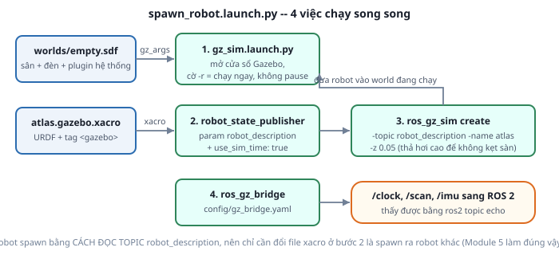

# 4. Spawn robot vào world

*[← World file](03-world-file.md) · [Mục lục module](00-gioi-thieu.md) · Tiếp theo: [ros_gz_bridge →](05-ros-gz-bridge.md)*

## Định nghĩa

**Spawn** là đưa robot vào một world **đang chạy**, lúc runtime — khác với viết robot thẳng vào file world. Node làm việc này là `create` của package `ros_gz_sim`.



## Cơ chế

`ros_gz_sim create` nhận mô tả robot theo 3 cách: `-file` (đường dẫn SDF/URDF), `-string` (chuỗi XML), hoặc **`-topic`** (đọc từ một topic ROS 2). Cách thứ ba là chuẩn mực trong ROS 2 vì nó ghép đúng với `robot_state_publisher`:

```
xacro → param robot_description → robot_state_publisher publish topic /robot_description
                                                            ↓
                                             create -topic robot_description
```

Lợi ích: Gazebo và `robot_state_publisher` dùng **chính xác cùng một mô tả robot**. Truyền file riêng cho mỗi bên là mở đường cho lỗi khó chịu nhất trong mô phỏng — hình học trong Gazebo lệch với cây TF trong RViz, mọi thứ trông "gần đúng" nhưng Nav2 thì sai.

Vì sao dùng launch file chứ không gõ tay từng lệnh: 4 tiến trình phải khởi động cùng nhau và **thứ tự có ý nghĩa** — `create` cần world đã sẵn sàng và topic `robot_description` đã có dữ liệu.

## Ví dụ trong dự án Atlas

`atlas_gazebo/launch/spawn_robot.launch.py` dựng 4 node của sơ đồ trên:

```python
gz_sim = IncludeLaunchDescription(                       # 1. mở world
    PythonLaunchDescriptionSource(
        os.path.join(ros_gz_sim_share, "launch", "gz_sim.launch.py")),
    launch_arguments={"gz_args": [world_path, " -r"]}.items(),
)

robot_state_publisher_node = Node(                       # 2. phát URDF + TF
    package="robot_state_publisher", executable="robot_state_publisher",
    parameters=[{"robot_description": robot_description, "use_sim_time": True}],
)

spawn_robot_node = Node(                                 # 3. thả robot vào world
    package="ros_gz_sim", executable="create",
    arguments=["-topic", "robot_description", "-name", "atlas",
               "-x", LaunchConfiguration("x"), "-y", LaunchConfiguration("y"),
               "-z", "0.05", "-Y", LaunchConfiguration("yaw")],
)
```

Bốn chi tiết đáng chú ý:

**`-r` trong `gz_args`** — chạy mô phỏng ngay, không ở trạng thái pause. Thiếu cờ này thì Gazebo mở ra ở trạng thái dừng: robot đứng im, `/clock` không nhích, và mọi node ROS 2 đặt `use_sim_time=true` sẽ **treo vĩnh viễn chờ thời gian** ([bài 5](05-ros-gz-bridge.md)). Triệu chứng "không có gì chạy cả, cũng không có lỗi nào" thường chỉ là quên bấm nút Play.

**`-z 0.05`** — thả robot cao hơn mặt sàn 5 cm thay vì đúng 0. Spawn dính sát sàn dễ khiến collision của robot và của sàn chồng lấn nhau ngay khung hình đầu, bộ giải phản ứng bằng một lực đẩy lớn và robot bật lên. Thả hơi cao rồi để nó tự rơi xuống là cách an toàn hơn.

**`-name atlas`** — tên thực thể trong Gazebo. Trùng tên với model đã có thì spawn thất bại. Đây cũng là tên dùng khi chạy nhiều robot (phụ lục B).

**`model` là launch argument, không hard-code** — mặc định là `atlas.gazebo.xacro`, nhưng Module 5 sẽ gọi lại chính launch file này với `model:=atlas.control.xacro` để spawn bản robot có thêm `ros2_control`. Một launch file dùng cho cả 3 lớp xacro.

## Thử ngay

```bash
ros2 launch atlas_gazebo spawn_robot.launch.py
```
Kiểm tra từng mắt xích:
```bash
ros2 topic echo /robot_description --once | head -5   # URDF đã lên topic chưa
gz model -l                                            # Gazebo có thấy model "atlas" không
ros2 run tf2_tools view_frames                         # cây TF vẫn đủ 8 frame như Module 3
```

Thử spawn ở chỗ khác và soi kỹ tham số:
```bash
ros2 launch atlas_gazebo spawn_robot.launch.py world:=maze.sdf x:=-2.5 y:=-2.0 yaw:=1.57
```
`yaw:=1.57` ≈ 90° — robot quay sang trái so với hướng mặc định, đúng quy ước REP-103 ([Module 2](../module-02-tf2-toa-do/03-rep103-rep105.md)): góc dương là ngược chiều kim đồng hồ nhìn từ trên xuống.

Hai bài quan sát đáng làm:
1. Đổi `-z` thành `1.0` trong launch file → robot rơi từ độ cao 1 m. Nó phải **rơi và đứng yên**, không nảy lung tung: đó là bằng chứng inertia ở [bài 2](02-vat-ly-inertia.md) đúng.
2. Spawn 2 lần liên tiếp với cùng `-name` (chạy launch lần 2 khi lần 1 đang mở) → xem thông báo lỗi trùng tên.

---
*Tiếp theo: [ros_gz_bridge →](05-ros-gz-bridge.md)*
