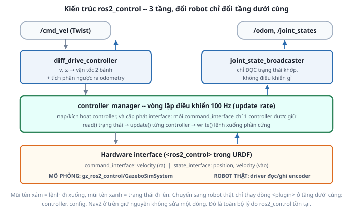

# 1. ros2_control là gì

*[← Mục lục module](00-gioi-thieu.md) · Tiếp theo: [Hardware interface →](02-hardware-interface.md)*

## Định nghĩa

**`ros2_control`** là bộ khung chuẩn của ROS 2 để điều khiển phần cứng robot theo thời gian thực. Nó chia bài toán "nhận lệnh → quay động cơ" thành **3 tầng tách rời**, nối với nhau qua một giao diện thống nhất.



## Cơ chế

**`controller_manager`** là trái tim: một vòng lặp chạy ở tần số cố định (`update_rate`, Atlas dùng 100 Hz), mỗi chu kỳ làm đúng 3 việc:

1. `read()` — đọc trạng thái thật từ phần cứng (góc quay, vận tốc bánh).
2. `update()` — gọi từng controller đang active để chúng tính lệnh mới.
3. `write()` — ghi lệnh xuống phần cứng.

Nó còn giữ vai trò **trọng tài tài nguyên**: mỗi `command_interface` chỉ được **đúng một** controller chiếm giữ tại một thời điểm. Hai controller cùng đòi điều khiển `left_wheel_joint/velocity` thì cái thứ hai bị từ chối kích hoạt. Ràng buộc này ngăn trường hợp hai bộ điều khiển đánh nhau trên cùng một động cơ — chuyện rất dễ xảy ra khi hệ thống lớn dần.

**Vì sao không viết thẳng một node cho nhanh?** Với riêng Atlas trong Gazebo thì viết tay đúng là nhanh hơn. Lợi ích chỉ lộ ra ở 3 tình huống, mà cả 3 đều sẽ gặp:

| Tình huống | Không có `ros2_control` | Có `ros2_control` |
|---|---|---|
| Chuyển sang robot thật | Viết lại node điều khiển | Đổi 1 dòng `<plugin>` ở tầng hardware |
| Đổi kiểu điều khiển (vị trí thay vì vận tốc) | Sửa logic bên trong node | Nạp controller khác, không sửa code |
| Nav2 cần điều khiển robot | Tự định nghĩa giao diện riêng | Nav2 đã nói `/cmd_vel` chuẩn sẵn |

Tách lớp cũng là lý do `diff_drive_controller`, `joint_state_broadcaster`, `jtc`... là **gói dùng chung cho mọi robot** — bạn không viết dòng code điều khiển nào trong cả khóa học này, chỉ cấu hình.

## Ví dụ trong dự án Atlas

Atlas dùng 2 controller có sẵn, không tự viết cái nào:

| Controller | Kiểu | Việc của nó |
|---|---|---|
| `diff_drive_controller/DiffDriveController` | điều khiển | Nhận `/cmd_vel`, chia ra vận tốc 2 bánh, tính ngược ra `/odom` |
| `joint_state_broadcaster/JointStateBroadcaster` | broadcaster | Chỉ đọc trạng thái khớp rồi publish `/joint_states` |

**Broadcaster khác controller ở chỗ nó không chiếm `command_interface` nào** — chỉ đọc. Vì vậy nó chạy song song với `diff_drive_controller` trên cùng 2 khớp bánh mà không xung đột.

`joint_state_broadcaster` chính là thứ thay thế `joint_state_publisher_gui` của [Module 3](../module-03-urdf-xacro/05-robot-state-publisher.md): từ giờ `/joint_states` mang **góc bánh xe thật trong mô phỏng**, không còn là slider kéo tay. Đó là lý do `spawn_robot.launch.py` phải tắt GUI khi chạy cùng Gazebo — hai nguồn cùng publish một topic sẽ đánh nhau.

Trong mô phỏng, `controller_manager` **không phải là node riêng bạn tự chạy**: plugin `gz_ros2_control` tạo nó ra bên trong tiến trình Gazebo ([bài 2](02-hardware-interface.md)). Đó là lý do khi plugin không nạp được, mọi thứ liên quan controller đều chết theo.

## Thử ngay

```bash
ros2 launch atlas_control controller.launch.py
```
```bash
ros2 control list_controllers          # 2 controller, đều active
ros2 control list_hardware_interfaces  # xem ai đang chiếm interface nào
ros2 node list | grep controller       # controller_manager có mặt
```

Kết quả `list_hardware_interfaces` cho thấy rõ mô hình "trọng tài": các `command interface` hiện `[claimed]` bởi `diff_drive_controller`, còn `state interface` thì ai đọc cũng được.

Thử tước quyền điều khiển lúc đang chạy:
```bash
ros2 control set_controller_state diff_drive_controller inactive
ros2 topic pub -r 10 /cmd_vel geometry_msgs/msg/Twist "{linear: {x: 0.2}}"   # robot KHÔNG chạy
ros2 control set_controller_state diff_drive_controller active                # chạy lại được
```
Đây là điều không làm được nếu tự viết node: bật/tắt, thay thế bộ điều khiển lúc robot đang hoạt động mà không khởi động lại gì.

---
*Tiếp theo: [Hardware interface →](02-hardware-interface.md)*
