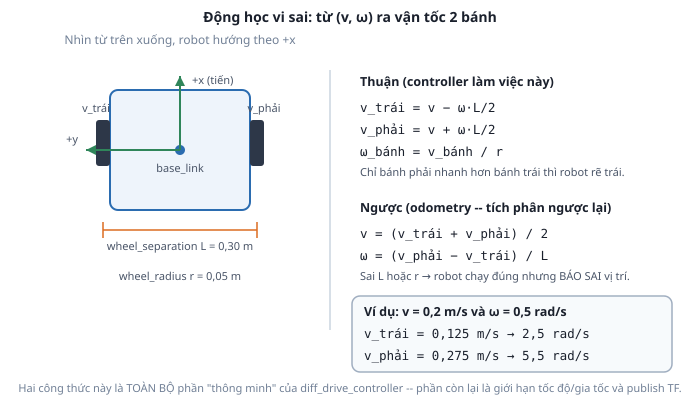

# 4. Động học vi sai (differential drive kinematics)

*[← Controller & spawner](03-controller-va-spawner.md) · [Mục lục module](00-gioi-thieu.md) · Tiếp theo: [Odometry & TF →](05-odom-va-tf.md)*

## Định nghĩa

Robot vi sai chỉ có 2 đại lượng điều khiển: vận tốc **tịnh tiến** `v` (m/s, theo trục x) và vận tốc **góc** `ω` (rad/s, quanh trục z) — đúng 2 trường `linear.x` và `angular.z` của message `Twist` trên `/cmd_vel`. **Động học vi sai** là phép đổi giữa cặp `(v, ω)` đó và vận tốc quay của 2 bánh.



## Cơ chế

Với `L` = `wheel_separation` (khoảng cách tâm 2 bánh) và `r` = `wheel_radius`:

**Chiều thuận** — từ lệnh ra bánh xe (việc controller làm 100 lần/giây):
```
v_trái  = v − ω·L/2          [m/s, vận tốc dài tại mép bánh]
v_phải  = v + ω·L/2
ω_bánh  = v_bánh / r         [rad/s, tốc độ quay gửi xuống động cơ]
```

**Chiều ngược** — từ bánh xe suy ra robot đang đi thế nào (dùng cho odometry, [bài 5](05-odom-va-tf.md)):
```
v = (v_trái + v_phải) / 2
ω = (v_phải − v_trái) / L
```

Đọc công thức ra ý nghĩa vật lý:
- Hai bánh **bằng nhau** → `ω = 0` → đi thẳng.
- Hai bánh **ngược dấu, cùng độ lớn** → `v = 0` → quay tại chỗ quanh tâm robot.
- Một bánh đứng yên → robot quay quanh chính bánh đó.
- Bánh phải nhanh hơn bánh trái → `ω > 0` → **rẽ trái** (ngược chiều kim đồng hồ, đúng REP-103, [Module 2](../module-02-tf2-toa-do/03-rep103-rep105.md)).

`L` và `r` trong công thức phải **khớp với robot vật lý**. Sai chúng thì hậu quả bất đối xứng, và đây là điểm đáng nhớ nhất của bài này:

| Sai ở đâu | Robot chạy | Robot báo cáo vị trí |
|---|---|---|
| `r` nhỏ hơn thật | Chậm hơn lệnh | Sai tỉ lệ quãng đường |
| `L` nhỏ hơn thật | Quay nhanh hơn lệnh | Góc tích lũy sai dần |

Robot vẫn di chuyển "trông có vẻ bình thường" trong cả hai trường hợp — chỉ tới khi vẽ bản đồ ở Module 8 mới thấy bản đồ méo. Đó là kiểu lỗi tệ nhất: lặng lẽ và phát tác muộn.

## Ví dụ trong dự án Atlas

Hai con số này xuất hiện ở **hai chỗ** và bắt buộc phải bằng nhau:

| Nơi | Vai trò |
|---|---|
| `atlas_description/urdf/atlas.urdf.xacro` | Hình học thật: bánh đặt ở đâu, to bằng nào |
| `atlas_control/config/diff_drive_controller.yaml` | Công thức controller dùng để tính |

```yaml
wheel_separation: 0.30     # = wheel_separation trong xacro
wheel_radius: 0.05         # = wheel_radius trong xacro
```

Đây là một trong số ít chỗ trong repo **buộc phải trùng lặp**: URDF và controller là 2 hệ thống độc lập, không tự đọc giá trị của nhau. Đổi bánh xe trong xacro ([bài tập Module 3](../module-03-urdf-xacro/07-bai-tap.md)) mà quên sửa YAML là lỗi kinh điển — và cũng là nội dung [bài tập](06-bai-tap.md) module này.

Ngoài động học, controller còn áp **giới hạn mềm**:
```yaml
linear.x.max_velocity: 0.5       linear.x.max_acceleration: 1.0
angular.z.max_velocity: 1.5      angular.z.max_acceleration: 3.0
```
Giới hạn **gia tốc** quan trọng không kém giới hạn vận tốc: nó làm mượt lệnh, tránh việc Nav2 hay teleop ra lệnh nhảy bậc khiến bánh xe trượt (mất bám → odometry sai). Đây là giới hạn ở tầng controller, khác với trần cứng ±10 rad/s khai trong `command_interface` ([bài 2](02-hardware-interface.md)).

## Thử ngay

```bash
ros2 launch atlas_control controller.launch.py
```

Kiểm chứng từng trường hợp của công thức, mỗi lệnh chạy vài giây rồi Ctrl+C:
```bash
# đi thẳng: 2 bánh phải quay bằng nhau
ros2 topic pub -r 10 /cmd_vel geometry_msgs/msg/Twist "{linear: {x: 0.2}, angular: {z: 0.0}}"

# quay tại chỗ: 2 bánh ngược dấu, robot không dịch chuyển
ros2 topic pub -r 10 /cmd_vel geometry_msgs/msg/Twist "{linear: {x: 0.0}, angular: {z: 0.5}}"

# vừa tiến vừa rẽ trái
ros2 topic pub -r 10 /cmd_vel geometry_msgs/msg/Twist "{linear: {x: 0.2}, angular: {z: 0.5}}"
```

Xem vận tốc bánh thật để đối chiếu với công thức:
```bash
ros2 topic echo /joint_states --once
```
Trường `velocity` là tốc độ quay (rad/s) của `left_wheel_joint` và `right_wheel_joint` — chính là `ω_bánh` trong công thức. Với lệnh cuối ở trên, giá trị mong đợi là **2,5** và **5,5 rad/s**; [bài tập](06-bai-tap.md) sẽ bắt bạn tự tính ra 2 số này trước khi xem.

Kiểm chứng giới hạn: ra lệnh vượt trần và quan sát controller kẹp lại.
```bash
ros2 topic pub -r 10 /cmd_vel geometry_msgs/msg/Twist "{linear: {x: 5.0}}"
ros2 topic echo /odom --once | grep -A3 "linear"     # không vượt quá 0.5 m/s
```

---
*Tiếp theo: [Odometry & TF →](05-odom-va-tf.md)*
