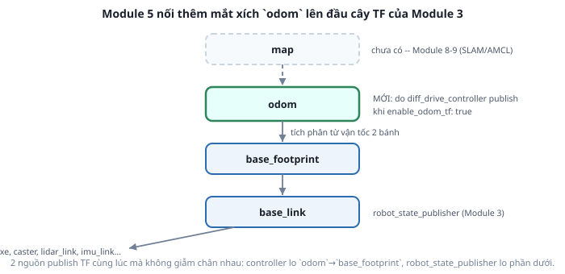

# 5. Odometry và TF `odom` → `base_footprint`

*[← Động học vi sai](04-dong-hoc-vi-sai.md) · [Mục lục module](00-gioi-thieu.md) · Tiếp theo: [Bài tập →](06-bai-tap.md)*

## Định nghĩa

**Odometry** là ước lượng vị trí robot bằng cách **cộng dồn** quãng đường 2 bánh đã quay, tính từ lúc khởi động. Không dùng cảm biến ngoài, không cần bản đồ — chỉ đếm vòng quay bánh xe.

`diff_drive_controller` xuất odometry ra **2 nơi cùng lúc**: topic `/odom` (`nav_msgs/Odometry`, gồm pose + twist + covariance) và transform `odom` → `base_footprint` trên `/tf`.



## Cơ chế

Mỗi chu kỳ, controller đọc vận tốc 2 bánh, dùng **công thức chiều ngược** ([bài 4](04-dong-hoc-vi-sai.md)) ra `(v, ω)` của robot, rồi tích phân theo thời gian để cập nhật `(x, y, θ)`.

Đặc tính của phép cộng dồn này quyết định toàn bộ cách ROS tổ chức hệ tọa độ:

- **Mượt và liên tục** — không bao giờ nhảy bậc, vì mỗi bước chỉ cộng thêm một lượng nhỏ.
- **Trôi (drift) không hồi phục** — mỗi sai số nhỏ (bánh trượt, `r` lệch vài mm, làm tròn số) cộng dồn mãi mãi. Chạy đủ lâu, odometry luôn sai.
- **Không có tham chiếu ngoài** — robot khởi động ở đâu thì chỗ đó là gốc `(0,0,0)`.

Đây chính xác là lý do REP-105 ([Module 2 bài 3](../module-02-tf2-toa-do/03-rep103-rep105.md)) tách `map` và `odom` thành 2 frame riêng: `odom`→`base_footprint` mượt nhưng trôi (dùng cho điều khiển ngắn hạn), còn `map`→`odom` nhảy bậc nhưng đúng về lâu dài (do SLAM/AMCL sửa, Module 8-9). Ở Module 5 khái niệm đó chuyển từ lý thuyết thành thứ bạn `echo` ra xem được.

## Ví dụ trong dự án Atlas

```yaml
odom_frame_id: odom
base_frame_id: base_footprint
enable_odom_tf: true
publish_rate: 50.0
pose_covariance_diagonal: [0.001, 0.001, 0.0, 0.0, 0.0, 0.01]
twist_covariance_diagonal: [0.001, 0.0, 0.0, 0.0, 0.0, 0.01]
open_loop: false
```

**`base_frame_id: base_footprint`, không phải `base_link`** — đúng thiết kế từ [Module 3](../module-03-urdf-xacro/06-doc-urdf-atlas.md): `base_footprint` là hình chiếu robot xuống sàn, và robot chỉ di chuyển trong mặt phẳng. Gắn odometry vào `base_link` (cao hơn 5 cm) sẽ làm cả cây TF lệch một khoảng cố định theo z.

**`enable_odom_tf: true`** là công tắc quyết định controller có publish TF hay chỉ publish topic. Để `true` ở đây vì Atlas chưa có bộ lọc nào khác. Khi nào đặt `false`? Khi hệ thống có `robot_localization` (EKF) hợp nhất odometry bánh xe với IMU — lúc đó EKF mới là nơi publish `odom`→`base_footprint`, và để cả hai cùng publish sẽ tạo ra 2 nguồn cho cùng một transform, đúng kiểu lỗi "1 frame 2 cha" ([Module 2](../module-02-tf2-toa-do/02-tf-tree.md)).

**`open_loop: false`** — tính odometry từ vận tốc **đo được** (state interface) chứ không từ vận tốc **ra lệnh**. Đặt `true` thì robot bị chặn đứng bởi tường vẫn tưởng mình đang tiến đều, vì nó chỉ cộng dồn lệnh đã gửi.

**Covariance** là mức độ "tôi tin số này đến đâu", cho các bộ lọc phía sau (AMCL Module 9, EKF nếu có). Số 0,001 cho x/y và 0,01 cho yaw phản ánh đúng đặc tính odometry vi sai: ước lượng góc kém tin cậy hơn ước lượng quãng đường.

Sau module này, cây TF của Atlas có **2 nguồn publish** cùng lúc mà không giẫm chân nhau: `diff_drive_controller` lo mắt `odom`→`base_footprint`, `robot_state_publisher` lo toàn bộ phần từ `base_footprint` trở xuống.

## Thử ngay

```bash
ros2 launch atlas_control controller.launch.py
```
```bash
ros2 topic echo /odom --once                     # pose + twist + covariance
ros2 run tf2_ros tf2_echo odom base_footprint    # đúng con số pose ở trên
ros2 run tf2_tools view_frames                   # cây TF giờ có gốc là odom
```

**Bài đo drift** — thí nghiệm quan trọng nhất module này:
```bash
# 1. ghi lại pose ban đầu
ros2 topic echo /odom --once | grep -A3 position

# 2. quay tại chỗ liên tục 30-60 giây
ros2 topic pub -r 10 /cmd_vel geometry_msgs/msg/Twist "{angular: {z: 1.0}}"

# 3. dừng, đọc lại pose
ros2 topic echo /odom --once | grep -A3 position
```
Về lý thuyết quay tại chỗ thì `x`, `y` không được đổi. Thực tế chúng đã trôi đi vài cm — bánh trượt nhẹ trên sàn, sai số tích lũy. Robot thật trôi nhiều hơn mô phỏng. Con số bạn vừa đo chính là lý do tồn tại của SLAM và AMCL ở Module 8-9.

So sánh 2 kiểu dữ liệu vị trí trong RViz: mở `rviz2`, đặt **Fixed Frame = `odom`**, thêm display `RobotModel`, `TF`, `Odometry (/odom)`. Lái robot đi một vòng rồi quay về chỗ cũ — vệt `Odometry` sẽ không khép kín hoàn hảo.

---
*Tiếp theo: [Bài tập →](06-bai-tap.md)*
