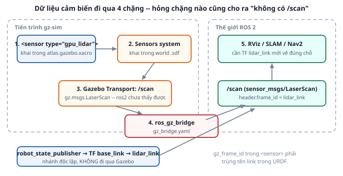

# 1. Khai báo cảm biến cho gz-sim

*[← Mục lục module](00-gioi-thieu.md) · Tiếp theo: [LaserScan →](02-laserscan.md)*

## Định nghĩa

Trong gz-sim, cảm biến là thẻ **`<sensor>`** chuẩn SDF gắn vào một link, khai trong tag `<gazebo reference="...">`. **Không có plugin riêng cho từng cảm biến** — đây là khác biệt lớn so với Gazebo Classic, nơi mỗi loại cảm biến cần một `libgazebo_ros_*.so`.

## Cơ chế

Dữ liệu đi qua **4 chặng**, và hỏng chặng nào cũng cho ra cùng một triệu chứng "không có `/scan`":



| Chặng | Ở đâu | Thiếu thì |
|---|---|---|
| 1. `<sensor>` khai trong URDF | `atlas.gazebo.xacro` | Không có cảm biến nào tồn tại |
| 2. **System plugin** trong world | `worlds/*.sdf` | Cảm biến tồn tại nhưng không phát dữ liệu |
| 3. Gazebo Transport | tự động | — |
| 4. **ros_gz_bridge** | `gz_bridge.yaml` | Gazebo có dữ liệu, ROS 2 không thấy |

Chặng 2 hay bị quên nhất. Mỗi **loại** cảm biến cần một system plugin riêng trong world ([Module 4 bài 3](../module-04-gazebo/03-world-file.md)):

```xml
<plugin filename="gz-sim-sensors-system" name="gz::sim::systems::Sensors">
  <render_engine>ogre2</render_engine>
</plugin>
<plugin filename="gz-sim-imu-system" name="gz::sim::systems::Imu"/>
```

`Sensors` lo mọi cảm biến **dựa trên render** (lidar, camera, depth) — vì thế nó cần `<render_engine>`. `Imu` là hệ thống riêng vì IMU không render gì cả, nó đọc thẳng trạng thái động lực học của link.

Hệ quả thực tế: **LiDAR không chạy nếu không render được.** Trên máy không có GPU hoặc chạy headless, `gpu_lidar` có thể im lặng. Lúc đó đổi sang `type="lidar"` (bản CPU, chậm hơn nhưng không cần GPU).

## Ví dụ trong dự án Atlas

LiDAR trong `atlas_gazebo/urdf/atlas.gazebo.xacro`:

```xml
<gazebo reference="lidar_link">
  <sensor name="lidar_sensor" type="gpu_lidar">
    <always_on>true</always_on>
    <update_rate>10</update_rate>
    <visualize>true</visualize>
    <topic>scan</topic>
    <gz_frame_id>lidar_link</gz_frame_id>
    <lidar>
      <scan><horizontal>
        <samples>360</samples>
        <min_angle>-3.14159</min_angle>
        <max_angle>3.14159</max_angle>
      </horizontal></scan>
      <range><min>0.12</min><max>10.0</max><resolution>0.01</resolution></range>
      <noise><type>gaussian</type><mean>0.0</mean><stddev>0.01</stddev></noise>
    </lidar>
  </sensor>
</gazebo>
```

Bốn lựa chọn đáng giải thích:

**`update_rate` 10 Hz** — đúng tầm LiDAR 2D giá rẻ thật (RPLIDAR A1 quay ~5,5-10 Hz). Đặt 30 Hz cho "mượt" là tự lừa mình: SLAM sẽ chạy tốt trong mô phỏng rồi thất bại trên robot thật.

**`<noise>` gaussian stddev 0,01 m** — cố ý thêm nhiễu ±1 cm. Cảm biến hoàn hảo làm SLAM trông dễ hơn thực tế rất nhiều; thêm nhiễu là để thuật toán ở Module 8 phải đối mặt với bài toán thật.

**`range.min` 0,12 m** — LiDAR thật có vùng mù sát tâm quay. Giá trị dưới ngưỡng này là rác, phải bỏ ([bài 2](02-laserscan.md)).

**`<topic>scan</topic>`** — tên topic phía **Gazebo Transport**, chưa phải topic ROS. Nó chỉ thành `/scan` của ROS sau khi qua bridge.

IMU gọn hơn nhiều:
```xml
<gazebo reference="imu_link">
  <sensor name="imu_sensor" type="imu">
    <always_on>true</always_on>
    <update_rate>100</update_rate>
    <topic>imu</topic>
    <gz_frame_id>imu_link</gz_frame_id>
  </sensor>
</gazebo>
```
100 Hz vì IMU thật chạy nhanh hơn LiDAR một bậc — nó đo chuyển động chứ không quét hình học.

Cả hai đều nằm trong `atlas_gazebo`, **không** trong `atlas_description` — giữ đúng nguyên tắc URDF gốc không phụ thuộc simulator ([Module 3 bài 6](../module-03-urdf-xacro/06-doc-urdf-atlas.md)). `atlas_description` chỉ mô tả *vỏ hộp* cảm biến nằm ở đâu; việc nó phát ra dữ liệu là chuyện của lớp mô phỏng.

## Thử ngay

```bash
ros2 launch atlas_bringup bringup.launch.py world:=maze.sdf
```
Kiểm tra từng chặng theo thứ tự:
```bash
gz topic -l | grep -E "scan|imu"     # chặng 1-3: Gazebo có phát không? (máy bạn có thể là `ign topic`)
ros2 topic list | grep -E "scan|imu" # chặng 4: bridge có đưa sang không?
ros2 topic hz /scan                  # ~10 Hz, khớp update_rate
ros2 topic hz /imu                   # ~100 Hz
```

Thử tháo từng chặng để nhận mặt triệu chứng (khôi phục sau):
1. Xóa `gz-sim-sensors-system` trong world → `gz topic -l` **không còn** `/scan`. Cảm biến tồn tại nhưng không ai mô phỏng nó.
2. Comment khối `/scan` trong `gz_bridge.yaml` → `gz topic -l` **vẫn có**, `ros2 topic list` **không có**. Dữ liệu vẫn được sinh ra, chỉ là không qua được ranh giới.

Hai triệu chứng này trông giống nhau từ phía ROS, nhưng `gz topic -l` phân biệt được ngay — đó là lý do nó là lệnh đầu tiên cần chạy.

---
*Tiếp theo: [LaserScan →](02-laserscan.md)*
