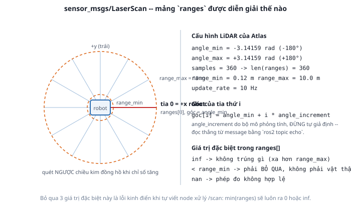

# 2. `sensor_msgs/LaserScan` — đọc từng field

*[← Khai báo cảm biến](01-sensor-trong-gazebo.md) · [Mục lục module](00-gioi-thieu.md) · Tiếp theo: [IMU →](03-imu.md)*

## Định nghĩa

`LaserScan` mô tả **một vòng quét**: một mảng khoảng cách, cộng với đủ thông tin để biết mỗi phần tử trong mảng ứng với hướng nào.



## Cơ chế

```
std_msgs/Header header        # stamp + frame_id  <- quan trọng ngang phần dữ liệu
float32 angle_min             # góc của tia ĐẦU TIÊN (rad)
float32 angle_max             # góc của tia CUỐI CÙNG
float32 angle_increment       # góc giữa 2 tia liên tiếp
float32 time_increment         # thời gian giữa 2 phép đo
float32 scan_time             # thời gian trọn 1 vòng quét
float32 range_min             # dưới ngưỡng này -> không tin được
float32 range_max             # trên ngưỡng này -> không tin được
float32[] ranges              # MẢNG KHOẢNG CÁCH (m)
float32[] intensities         # cường độ phản xạ, thường rỗng
```

Quy tắc diễn giải, học thuộc một lần dùng mãi:

```
góc của ranges[i] = angle_min + i * angle_increment
```

Góc này tính **trong frame của cảm biến** (`header.frame_id`), theo REP-103: 0 rad là hướng +x, góc dương quay ngược chiều kim đồng hồ ([Module 2](../module-02-tf2-toa-do/03-rep103-rep105.md)).

**Ba giá trị đặc biệt trong `ranges[]`** — bỏ qua chúng là lỗi kinh điển khi tự viết node xử lý:

| Giá trị | Nghĩa | Xử lý |
|---|---|---|
| `inf` | Tia không trúng gì trong tầm | Bỏ qua, **không** coi là khoảng cách 0 |
| `< range_min` | Trong vùng mù cảm biến | Bỏ qua, không phải vật thật |
| `nan` | Phép đo không hợp lệ | Bỏ qua |

Viết `min(msg.ranges)` để tìm vật gần nhất là sai — kết quả sẽ luôn ra một giá trị rác. Cách đúng:

```python
valid = [r for r in msg.ranges if msg.range_min < r < msg.range_max]
nearest = min(valid) if valid else float("inf")
```

**`header.stamp` quan trọng ngang dữ liệu.** SLAM phải ghép mỗi vòng quét với vị trí robot **tại đúng thời điểm quét**. Timestamp sai vài trăm ms là bản đồ nhòe — đây chính là lý do `use_sim_time` phải đúng từ [Module 4](../module-04-gazebo/05-ros-gz-bridge.md).

## Ví dụ trong dự án Atlas

Cấu hình đã khai ở [bài 1](01-sensor-trong-gazebo.md) cho ra message có đặc điểm:

| Field | Giá trị | Từ đâu |
|---|---|---|
| `len(ranges)` | 360 | `<samples>` |
| `angle_min` / `angle_max` | ≈ −π / +π | `<min_angle>` / `<max_angle>` |
| `angle_increment` | ≈ 0,0175 rad (~1°) | bộ mô phỏng tính từ 2 giá trị trên |
| `range_min` / `range_max` | 0,12 / 10,0 m | `<range>` |
| `scan_time` | ≈ 0,1 s | `update_rate` 10 Hz |
| `frame_id` | `lidar_link` | `<gz_frame_id>` |

**Đừng tự tính `angle_increment` rồi giả định.** Tùy bản mô phỏng mà công thức là `(max−min)/samples` hay `(max−min)/(samples−1)` — chênh nhau nhỏ nhưng tích lũy qua 360 tia thì tia cuối lệch thấy rõ. Luôn đọc thẳng từ message.

LiDAR Atlas quét **trọn 360°**, nghĩa là robot thấy cả phía sau. LiDAR thật hay bị thân robot che một góc; muốn mô phỏng sát thực tế hơn, thu hẹp `min_angle`/`max_angle` lại.

## Thử ngay

```bash
ros2 launch atlas_bringup bringup.launch.py world:=maze.sdf
```

```bash
# Xem metadata, cắt bỏ mảng ranges dài 360 phần tử cho dễ đọc
ros2 topic echo /scan --once --no-arr

# Xem kiểu message đầy đủ
ros2 interface show sensor_msgs/msg/LaserScan
```

**Kiểm chứng "tia 0 là hướng +x"** — bài tập nhỏ nhưng làm rõ mọi thứ:
```bash
python3 - <<'PY'
import rclpy, math
from rclpy.node import Node
from sensor_msgs.msg import LaserScan

class Probe(Node):
    def __init__(self):
        super().__init__("probe")
        self.create_subscription(LaserScan, "/scan", self.cb, 10)
    def cb(self, m):
        def at(deg):
            i = int(round((math.radians(deg) - m.angle_min) / m.angle_increment))
            i = max(0, min(i, len(m.ranges) - 1))
            r = m.ranges[i]
            return f"{r:.2f}m" if m.range_min < r < m.range_max else "---"
        self.get_logger().info(
            f"trước(0°)={at(0)}  trái(90°)={at(90)}  sau(180°)={at(180)}  phải(-90°)={at(-90)}")
        raise SystemExit

rclpy.init()
try: rclpy.spin(Probe())
except SystemExit: pass
PY
```
Lái robot lại gần một bức tường trong `maze.sdf`, chạy lại đoạn trên — hướng có tường phải cho số nhỏ, hướng trống cho `---` (tức `inf`). Đây là cách nhanh nhất để tự thuyết phục mình về quy ước góc.

---
*Tiếp theo: [IMU →](03-imu.md)*
