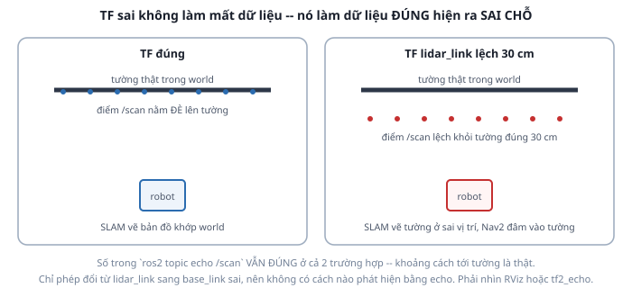

# 4. Frame của cảm biến — chỗ sai âm thầm nhất

*[← IMU](03-imu.md) · [Mục lục module](00-gioi-thieu.md) · Tiếp theo: [Xem & debug →](05-xem-va-debug.md)*

## Định nghĩa

Mọi message cảm biến mang `header.frame_id` — tên frame mà **số liệu bên trong được tính theo**. Không có nó, một mảng khoảng cách chỉ là một mảng số vô nghĩa.

Trong gz-sim, `frame_id` đến từ thẻ **`<gz_frame_id>`** trong `<sensor>`. Giá trị đó **phải trùng tên một link có thật trong URDF**.

## Cơ chế

Chuỗi mắt xích phải khớp nhau hoàn toàn:

```
URDF: <link name="lidar_link">          (Module 3)
   ↓  robot_state_publisher publish TF base_link → lidar_link
SDF:  <gz_frame_id>lidar_link</gz_frame_id>
   ↓
/scan: header.frame_id = "lidar_link"
   ↓
RViz / SLAM / Nav2: lookup_transform("base_link", "lidar_link") để đổi tọa độ điểm quét
```

Hai kiểu hỏng, triệu chứng khác hẳn nhau:

**Kiểu 1 — `frame_id` trỏ tới frame không tồn tại.** RViz báo lỗi đỏ rõ ràng ("No transform from [x] to [y]"), Nav2 từ chối dùng dữ liệu. Khó chịu nhưng **dễ phát hiện**.

**Kiểu 2 — `frame_id` đúng nhưng transform sai vị trí.** Không ai báo lỗi gì cả. Mọi node chạy bình thường. Dữ liệu vẫn đúng, chỉ là nó được đặt sai chỗ trong không gian.



Điểm cốt lõi của bài này: **`ros2 topic echo /scan` không phát hiện được kiểu 2.** Khoảng cách tới tường đo được là thật và đúng. Chỉ phép đổi từ `lidar_link` sang `base_link` sai. Muốn thấy, phải nhìn RViz hoặc so bằng `tf2_echo`.

Hậu quả dây chuyền: SLAM (Module 8) vẽ tường lệch đúng bằng độ lệch TF, bản đồ nhòe khi robot đi qua cùng chỗ theo hướng khác nhau; Nav2 (Module 10) tưởng có chỗ trống ở nơi thực ra là tường, và robot đâm vào.

## Ví dụ trong dự án Atlas

Ba nơi phải nhất quán, sửa một chỗ phải sửa đủ:

| Nơi | Nội dung |
|---|---|
| `atlas_description/urdf/sensors.xacro` | `<link name="lidar_link">` + `lidar_joint` gắn vào `base_link` |
| `atlas_gazebo/urdf/atlas.gazebo.xacro` | `<gz_frame_id>lidar_link</gz_frame_id>` |
| Cấu hình Nav2/SLAM (Module 8-10) | Tham số trỏ tới topic `/scan`, frame lấy từ message |

Vị trí LiDAR trên robot Atlas, theo `sensors.xacro`:
```xml
<origin xyz="${lidar_x_offset} 0 ${base_height + lidar_height / 2}" rpy="0 0 0"/>
```
tức lệch trước 5 cm, cao 0,14 m so với `base_link` (0,19 m so với mặt đất). **Con số này phải khớp với vị trí gắn LiDAR thật** khi lên phần cứng — đo bằng thước, đừng ước lượng. Lệch 2 cm là bản đồ lệch 2 cm ở mọi nơi.

Một lỗi dễ mắc mà không có cảnh báo nào: LiDAR thật thường **gắn lật ngược** (đầu cắm xuống). Lúc đó phải xoay `rpy` của `lidar_joint`, nếu không toàn bộ vòng quét bị phản chiếu gương — bản đồ trông "gần đúng" nhưng trái phải đảo nhau.

## Thử ngay

```bash
ros2 launch atlas_bringup bringup.launch.py world:=maze.sdf
```

Xác nhận chuỗi mắt xích:
```bash
ros2 topic echo /scan --once --no-arr | grep frame_id   # phải là lidar_link
ros2 run tf2_ros tf2_echo base_link lidar_link          # x=0.05, z=0.14
ros2 run tf2_tools view_frames                          # lidar_link có trong cây
```

**Bài debug ngược** — làm hẳn, đây là nội dung chính của [bài tập](06-bai-tap.md):

1. Mở `atlas_description/urdf/sensors.xacro`, đổi `lidar_joint` thành `<origin xyz="0.35 0 0.14" rpy="0 0 0"/>` (đẩy LiDAR ra trước 30 cm so với thật).
2. Build lại, chạy lại, mở RViz: Fixed Frame = `odom`, thêm `RobotModel`, `TF`, `LaserScan (/scan)`.
3. Quan sát: các điểm quét **lệch khỏi tường đúng 30 cm**, dù robot đứng yên và số trong `echo /scan` không đổi gì.
4. Lái robot quay một vòng — điểm quét "quét" thành hình lệch tâm.

Câu hỏi tự trả lời trước khi khôi phục: *nếu chỉ có `ros2 topic echo /scan` trong tay, bạn có cách nào phát hiện lỗi này không?* Câu trả lời là không — và đó là lý do RViz không phải công cụ "cho đẹp".

```bash
git checkout src/atlas_description
```

---
*Tiếp theo: [Xem & debug →](05-xem-va-debug.md)*
