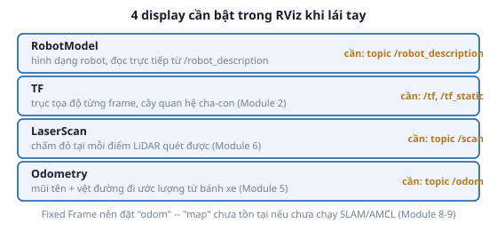

# 2. Tự cấu hình RViz

*[← teleop_twist_keyboard](01-teleop-twist-keyboard.md) · [Mục lục module](00-gioi-thieu.md) · Tiếp theo: [twist_mux →](03-twist-mux.md)*

## Định nghĩa

RViz là công cụ hiển thị trực quan dữ liệu ROS 2 (không mô phỏng vật lý — đó là việc của Gazebo). Mỗi loại dữ liệu cần 1 **display** riêng, tự thêm bằng tay qua nút *Add*.



## Cơ chế

Thêm display qua `Add → By topic`, chọn đúng kiểu message RViz gợi ý (vd `/scan` → `LaserScan`). 2 tham số toàn cục quan trọng nhất:
- **Fixed Frame**: frame làm gốc quy chiếu để vẽ mọi thứ khác — đặt `odom` ở module này (chưa có `map` vì chưa chạy SLAM/AMCL, xem lại [REP-105, Module 2](../module-02-tf2-toa-do/03-rep103-rep105.md)).
- **Global Options → Background Color**: không ảnh hưởng dữ liệu, chỉ để nhìn rõ hơn.

Dự án này **cố tình không đóng gói sẵn 1 file `.rviz`** trong 1 package riêng (từng có `atlas_teleop` làm việc này, đã bỏ) — tự thêm display 1 lần cho bạn thấy RViz không có gì "ma thuật", mỗi display chỉ đơn giản subscribe đúng 1 topic rồi vẽ ra. Sau khi cấu hình xong, `File → Save Config As` lưu lại `.rviz` riêng để tái dùng — không phải làm lại từ đầu mỗi lần, chỉ là không có ai làm sẵn hộ.

## Ví dụ trong dự án Atlas

Config RViz **đã lưu sẵn** vẫn tồn tại ở 2 chỗ khác trong repo — nhưng cho mục đích khác, không phải teleop chung chung:
- `atlas_description/rviz/atlas_view.rviz` — chỉ xem URDF tĩnh (Module 3), không có `/scan`/`/odom`.
- `atlas_slam/rviz/nav2_default_view.rviz`, `slam_toolbox_default.rviz` — cấu hình riêng cho Module 8-10, có thêm display `Map`, `Costmap`, `Path` chưa cần ở module này.

Không có file nào "đúng cho mọi việc" — mỗi module cần nhìn thấy dữ liệu khác nhau, đó là lý do tự cấu hình quan trọng hơn là nhớ 1 file.

## Thử ngay

```bash
ros2 launch atlas_bringup bringup.launch.py world:=maze.sdf
rviz2
```
1. Set **Fixed Frame** = `odom`.
2. `Add → By topic` → `RobotModel`, `TF`, `/scan → LaserScan`, `/odom → Odometry`.
3. Lái vài bước (`ros2 run teleop_twist_keyboard teleop_twist_keyboard`), quan sát cả 4 display đổi theo: robot model di chuyển, trục TF đi theo, chấm LaserScan quét tường, mũi tên Odometry để lại vệt đường đi.
4. `File → Save Config As` → `my_teleop_view.rviz` (không commit vào `src/`, chỉ để tái dùng cá nhân).

---
*Tiếp theo: [twist_mux →](03-twist-mux.md)*
