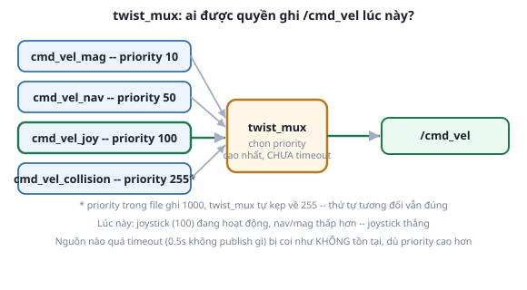

# 3. `twist_mux` — trọng tài khi nhiều nguồn cùng phát `cmd_vel`

*[← Cấu hình RViz](02-cau-hinh-rviz.md) · [Mục lục module](00-gioi-thieu.md) · Tiếp theo: [Bài tập →](04-bai-tap.md)*

## Định nghĩa

`twist_mux` gộp nhiều topic `Twist` đầu vào thành đúng 1 topic đầu ra (`/cmd_vel`), chọn nguồn theo **priority** (số càng cao càng ưu tiên) — giải quyết câu hỏi "nếu bàn phím VÀ Nav2 cùng publish `cmd_vel` một lúc, robot nghe ai?".



## Cơ chế

Mỗi nguồn khai báo 3 thứ: `topic` (input riêng, vd `cmd_vel_joy`), `priority` (0-255, **tự động kẹp** nếu khai >255), `timeout` (giây — quá thời gian này không thấy message mới, nguồn bị coi như "im lặng", dù priority cao vẫn bị bỏ qua). `twist_mux` publish ra `/cmd_vel_out` (thường remap thành `/cmd_vel` thật) đúng dữ liệu của nguồn **priority cao nhất trong số các nguồn CÒN SỐNG** tại mỗi thời điểm.

Hệ quả thiết kế quan trọng: muốn 1 nguồn luôn thắng (vd dừng khẩn cấp khi sắp va chạm), chỉ cần đặt priority cao nhất — không cần nguồn khác "biết" nhường, `twist_mux` tự động chọn, các node phát `cmd_vel` khác không cần biết sự tồn tại của nhau.

## Ví dụ trong dự án Atlas

`atlas_bringup/config/joystick_teleop.yaml` khai 4 nguồn thật (đã chạy, không phải ví dụ suông):
```yaml
twist_mux:
  ros__parameters:
    topics:
      magnetic:         {topic: cmd_vel_mag,       timeout: 0.5, priority: 10}
      navigation:       {topic: cmd_vel_nav,        timeout: 0.5, priority: 50}
      joystick:         {topic: cmd_vel_joy,        timeout: 0.5, priority: 100}
      collision_detect: {topic: cmd_vel_collision,  timeout: 0.5, priority: 1000}
```
Đã tự kiểm chứng qua log lúc chạy: `collision_detect` khai `1000` nhưng thực chạy ở mức `255` (giới hạn cứng của `twist_mux`) — thứ tự tương đối (collision > joystick > navigation > magnetic) vẫn đúng, chỉ con số hiển thị không phải 1000. `navigation` (priority 50) hiện là input DỰ TRÙ cho Nav2 (Module 10) — bản thân module đó chưa publish gì vào `cmd_vel_nav`, `twist_mux` vẫn chạy bình thường, input rỗng không gây lỗi.

Module này chỉ dùng `teleop_twist_keyboard` publish THẲNG vào `/cmd_vel`, KHÔNG qua `twist_mux` — nếu chạy đồng thời với `atlas_bringup joystick_teleop.launch.py` (joystick), 2 nguồn sẽ giẫm chân lên nhau vì `teleop_twist_keyboard` không đi qua cơ chế ưu tiên nào cả. Đừng chạy cùng lúc.

## Thử ngay

```bash
ros2 launch atlas_bringup bringup.launch.py world:=maze.sdf
ros2 launch atlas_bringup joystick_teleop.launch.py   # cần gamepad, xem README nếu chưa có
```
```bash
ros2 topic pub -r 5 /cmd_vel_nav geometry_msgs/msg/Twist "{linear: {x: 0.3}}"   # giả lập Nav2
```
Vừa giữ cần điều khiển (priority 100) vừa chạy lệnh `topic pub` trên (priority 50) — robot phải nghe theo cần điều khiển. Buông cần điều khiển >0.5s (hết timeout), robot chuyển sang nghe lệnh giả lập Nav2.

---
*Tiếp theo: [Bài tập →](04-bai-tap.md)*
