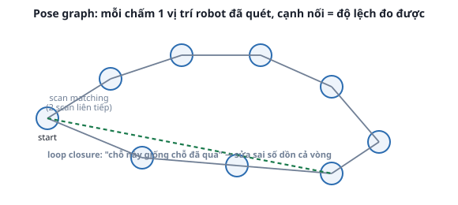
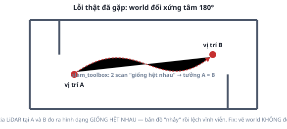

# 1. SLAM là gì

*[← Mục lục module](00-gioi-thieu.md) · Tiếp theo: [slam_toolbox thực hành →](02-slam-toolbox-thuc-hanh.md)*

## Định nghĩa

**SLAM** (Simultaneous Localization And Mapping) là bài toán giải **đồng thời** 2 việc phụ thuộc lẫn nhau: biết robot đang ở đâu (localization) THÌ mới vẽ đúng bản đồ (mapping), nhưng có bản đồ đúng THÌ mới biết chắc robot đang ở đâu — không có cái nào đi trước.

## Cơ chế

**Scan matching**: so 2 lần quét LiDAR liên tiếp, tìm phép dịch chuyển (tịnh tiến + xoay) khớp 2 đám mây điểm đó nhất — ra được "robot đã di chuyển bao nhiêu" chính xác hơn chỉ dùng encoder bánh xe (encoder trôi dần, xem lại [REP-105, Module 2](../module-02-tf2-toa-do/03-rep103-rep105.md)).

**Pose graph**: mỗi lần quét lưu thành 1 **node** (vị trí ước lượng), nối với node trước bằng 1 **cạnh** (độ lệch đo bằng scan matching). Ghép toàn bộ chuỗi cạnh lại = quỹ đạo robot = bản đồ.



**Loop closure**: sai số mỗi lần scan matching tuy nhỏ nhưng CỘNG DỒN theo quãng đường — đi 1 vòng dài, điểm cuối có thể lệch khá xa so với thật. Khi robot quay lại 1 chỗ đã từng quét, thuật toán nhận ra "2 scan này giống nhau" → thêm 1 cạnh **không liên tiếp** nối thẳng 2 node đó → tối ưu lại TOÀN BỘ pose graph cho khớp cạnh mới này, kéo sai số cộng dồn về gần 0. Không có loop closure, bản đồ 1 vòng kín thường bị "hở miệng" dù đi đúng đường.

**Khi loop closure nhận nhầm — lỗi thật đã gặp khi xây dự án này:**



World mê cung ban đầu có 2 vách đối xứng nhau qua tâm — tại 2 vị trí khác nhau hoàn toàn, tia LiDAR đo ra hình dạng gần như **giống hệt nhau**. `slam_toolbox` tưởng robot đã quay lại chỗ cũ, thêm 1 cạnh loop closure SAI, kéo bản đồ "nhảy" và lệch vĩnh viễn — không phải lỗi code, lỗi THIẾT KẾ WORLD thiếu đặc trưng phân biệt. Cách sửa gốc: vẽ world **không đối xứng** (xem [`maze.sdf`](../../overview/01-cau-truc-workspace.md), 3 vách trong dài khác nhau — 3.0/2.5/4.1m — cố ý, không phải tùy tiện).

## Ví dụ trong dự án Atlas

`atlas_slam/config/mapper_params.yaml` có nguyên 1 khối comment thuật lại đúng câu chuyện trên — đáng đọc hơn bất kỳ giải thích lý thuyết nào:
```yaml
# world maze.sdf ban đầu bị đối xứng tâm 180° ... khiến slam_toolbox thỉnh thoảng
# nhầm 2 vị trí đối xứng là cùng 1 chỗ (loop closure sai) -> bản đồ "nhảy" và lệch
# vĩnh viễn. Đã thêm 1 cột mốc phá đối xứng trong maze.sdf (fix gốc), ngưỡng chặt
# hơn ở đây là lớp phòng vệ thứ 2 ...
loop_match_minimum_response_coarse: 0.45   # mặc định 0.35 -- khó chấp nhận match hơn
loop_match_minimum_response_fine: 0.55     # mặc định 0.45
```
2 lớp phòng vệ cùng lúc: sửa world (gốc rễ) + siết ngưỡng (phòng hờ world khác do học viên tự vẽ cũng mắc lỗi tương tự).

## Thử ngay

Chưa cần chạy gì ở bài này — xem `src/atlas_slam/worlds` tương ứng (`atlas_gazebo/worlds/maze.sdf`), tìm 3 vách trong, tự đo độ dài từng vách (field `<size>` trong SDF), xác nhận cả 3 khác nhau thật — không phải chỉ đọc comment mà tin suông.

---
*Tiếp theo: [slam_toolbox thực hành →](02-slam-toolbox-thuc-hanh.md)*
