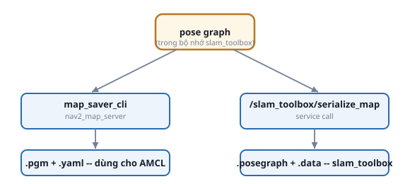

# 3. Lưu bản đồ — 2 định dạng, không thay thế cho nhau

*[← slam_toolbox thực hành](02-slam-toolbox-thuc-hanh.md) · [Mục lục module](00-gioi-thieu.md) · Tiếp theo: [Bài tập →](04-bai-tap.md)*

## Định nghĩa

Pose graph chỉ tồn tại TRONG BỘ NHỚ của `slam_toolbox` lúc đang chạy — tắt node là mất. Lưu ra file có 2 cách, phục vụ 2 mục đích khác hẳn nhau, **không đọc được lẫn nhau**.



## Cơ chế

**`.pgm` + `.yaml`** (qua `nav2_map_server`'s `map_saver_cli`) — ảnh occupancy grid (mỗi pixel = 1 ô, giá trị = xác suất có vật cản) + file YAML metadata (resolution, origin, ngưỡng). Đây là định dạng **AMCL** đọc (Module 9) — AMCL không cần biết gì về pose graph, chỉ cần 1 ảnh bản đồ tĩnh.

**`.posegraph` + `.data`** (qua service `/slam_toolbox/serialize_map`) — lưu NGUYÊN pose graph (mọi node, mọi cạnh, mọi scan gốc). Đây là định dạng **slam_toolbox ở `mode: localization`** cần (phương án thay AMCL, cũng ở Module 9) — vì nó cần làm lại scan matching, không chỉ đọc ảnh tĩnh.

Muốn dùng được CẢ 2 cách định vị sau này, phải lưu **CẢ 2 định dạng, CÙNG 1 lúc, CÙNG 1 phiên SLAM** — lưu riêng 2 lần ở 2 lần chạy SLAM khác nhau dễ ra 2 bản đồ hơi lệch nhau (world y hệt nhưng quỹ đạo lái khác đi).

## Ví dụ trong dự án Atlas

`src/atlas_slam/maps/README.md` ghi nguyên 2 lệnh dùng thật trong dự án:
```bash
ros2 run nav2_map_server map_saver_cli -f src/atlas_slam/maps/maze_map
```
```bash
ros2 service call /slam_toolbox/serialize_map slam_toolbox/srv/SerializePoseGraph \
  "{filename: '/đường/dẫn/tuyệt/đối/tới/src/atlas_slam/maps/maze_map'}"
```
**Lưu ý đã tự vấp phải**: `serialize_map` cần đường dẫn **tuyệt đối** — truyền tương đối bị hiểu theo thư mục làm việc của tiến trình `slam_toolbox`, không phải thư mục bạn gõ lệnh, dễ ra file ở chỗ không ngờ tới. `map_saver_cli` thì không kén, nhận cả đường dẫn tương đối.

Bản đồ thật trong repo (`src/atlas_slam/maps/maze_map.*`) có đủ cả 4 file (`.pgm`, `.yaml`, `.posegraph`, `.data`) — xác nhận bằng:
```bash
ls -la src/atlas_slam/maps/
```

## Thử ngay

Không cần chạy SLAM lại — đọc thử `maze_map.yaml` (metadata), đối chiếu với `maze_map.pgm` (mở bằng trình xem ảnh bất kỳ, kể cả trình duyệt):
```bash
cat src/atlas_slam/maps/maze_map.yaml
```
Xác định `resolution` (m/pixel) và `origin` (tọa độ pixel [0,0] ứng với điểm nào trong `map` frame) — 2 giá trị này là cầu nối giữa tọa độ ảnh và tọa độ robot thật, sẽ cần hiểu lại khi debug AMCL ở Module 9.

---
*Tiếp theo: [Bài tập →](04-bai-tap.md)*
