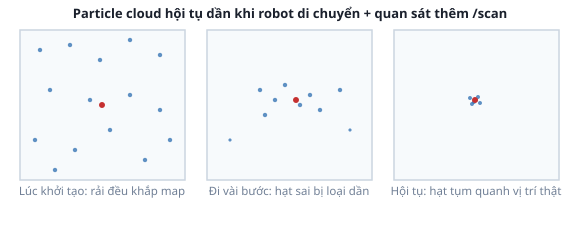

# 1. Particle Filter (Monte Carlo Localization)

*[← Mục lục module](00-gioi-thieu.md) · Tiếp theo: [AMCL thực hành →](02-amcl-thuc-hanh.md)*

## Định nghĩa

**AMCL** (Adaptive Monte Carlo Localization) định vị robot trên bản đồ ĐÃ CÓ bằng **particle filter**: thay vì tính ra 1 pose duy nhất, nó duy trì **hàng nghìn giả thuyết song song** ("hạt" — particle, mỗi hạt là 1 pose `(x, y, yaw)` khả dĩ), liên tục lọc bớt giả thuyết sai, giữ lại giả thuyết khớp dữ liệu cảm biến nhất.

## Cơ chế

Vòng lặp 3 bước, lặp lại mỗi khi robot di chuyển:
1. **Dự đoán (predict)**: mỗi hạt tự "di chuyển" theo đúng lệnh vận tốc robot vừa chạy (cộng thêm nhiễu ngẫu nhiên nhỏ — robot thật không di chuyển chính xác tuyệt đối).
2. **Cập nhật trọng số (update)**: so dữ liệu `/scan` thật với dữ liệu "nếu đứng ở vị trí hạt này thì sẽ thấy gì" (tính từ bản đồ) — hạt nào khớp thực tế hơn được trọng số cao hơn.
3. **Lấy mẫu lại (resample)**: hạt trọng số thấp bị loại, nhân bản thêm hạt quanh vị trí trọng số cao — đám mây hạt tự "co" dần về vị trí đúng.



**Vì sao phải rải hạt khắp map lúc khởi tạo**: không biết robot ở đâu — hạt chính là cách biểu diễn "sự không chắc chắn" đó. Rải càng rộng, càng chắc chắn vị trí thật nằm TRONG tập giả thuyết ban đầu (quan trọng khi không đặt "2D Pose Estimate" mà để AMCL tự dò toàn cục).

## Ví dụ trong dự án Atlas

`atlas_slam/config/nav2_params_*.yaml` (3 file, chung 1 khối `amcl`) cấu hình particle filter qua các tham số chính: số hạt tối thiểu/tối đa (`min_particles`/`max_particles`), và các hệ số nhiễu chuyển động (`alpha1`-`alpha5` — nhiễu càng lớn, hạt "dự đoán" càng tỏa rộng mỗi bước, bù cho encoder không hoàn hảo). RViz hiển thị đám mây hạt qua topic `/particle_cloud` — đúng dữ liệu thấy được ở [bài 2](02-amcl-thuc-hanh.md).

## Thử ngay

Chưa cần chạy AMCL ở bài này — xem trước cấu trúc tham số:
```bash
grep -A18 "^amcl:" src/atlas_slam/config/nav2_params_mppi.yaml
```
`min_particles: 500`, `max_particles: 2000` — ghi nhớ 2 số này, sẽ đối chiếu với tốc độ hội tụ thật ở bài tiếp theo.

---
*Tiếp theo: [AMCL thực hành →](02-amcl-thuc-hanh.md)*
