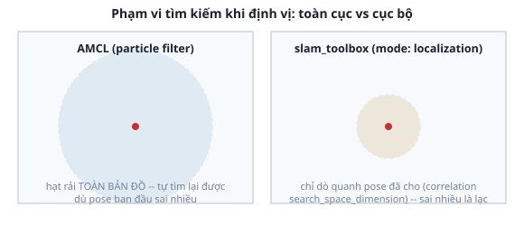

# 3. AMCL vs `slam_toolbox` — 2 cách định vị trong cùng dự án

*[← AMCL thực hành](02-amcl-thuc-hanh.md) · [Mục lục module](00-gioi-thieu.md) · Tiếp theo: [Bài tập →](04-bai-tap.md)*

## Định nghĩa

Dự án Atlas hỗ trợ **2 cách định vị** chọn qua 1 tham số (`localization:=amcl` hoặc `localization:=slam_toolbox`) — cùng làm 1 việc (publish `map`→`odom`), khác thuật toán: AMCL dùng particle filter ([bài 1](01-particle-filter.md)), `slam_toolbox` dùng lại chính cơ chế scan matching + pose graph đã học ở [Module 8](../module-08-slam/01-slam-nguyen-ly.md), chỉ đổi `mode: mapping` → `mode: localization` (không tạo thêm node mới, không tạo thêm bản đồ).

## Cơ chế

**Khác biệt cốt lõi: phạm vi tìm kiếm.**



- **AMCL**: particle filter rải hạt rộng, có khả năng tìm lại vị trí đúng dù pose ban đầu sai khá nhiều (global search).
- **slam_toolbox (`mode: localization`)**: correlative scan matching chỉ dò trong 1 cửa sổ hẹp quanh pose cho sẵn (tham số `correlation_search_space_dimension`, mặc định `0.5m` trong `mapper_params_localization.yaml`) — sai pose ban đầu nhiều là **lạc hẳn**, không tự tìm lại được.

Hệ quả trực tiếp — khác biệt lúc khởi động đã nhắc ở [bài 2](02-amcl-thuc-hanh.md): AMCL không cần `initial_pose` đúng ngay (chờ "2D Pose Estimate" sau khi chạy); `slam_toolbox` **bắt buộc** `map_start_pose` đúng NGAY lúc khởi động — thiếu, nó báo lỗi *"Map starting pose not specified"* rồi coi như vẽ map mới toanh thay vì định vị, dễ nhầm tưởng "map không nạp được".

**Vì sao panel Nav2 trong RViz luôn báo "Localization: Inactive" khi dùng `slam_toolbox`, dù robot chạy đúng** — không phải bug, đọc trực tiếp từ mã nguồn:
- `nav2_rviz_plugins/src/nav2_panel.cpp` hard-code tìm đúng tên node `lifecycle_manager_localization` để hỏi trạng thái.
- `slam_toolbox_common.hpp`: `class SlamToolbox : public rclcpp::Node` — kế thừa `Node` THƯỜNG, không phải `LifecycleNode` — không có khái niệm "Active/Inactive" để panel hỏi.

→ Panel chỉ "biết" hỏi đúng 1 kiểu node, `slam_toolbox` không thuộc kiểu đó — giới hạn thật của plugin, không sửa được nếu không đụng vào code `nav2_rviz_plugins`. Biết trước để không mất thời gian "debug" cái không hỏng.

## Ví dụ trong dự án Atlas

```bash
ros2 launch atlas_slam navigation.launch.py localization:=slam_toolbox \
  map:=$(pwd)/src/atlas_slam/maps/maze_map.yaml \
  initial_pose_x:=0.0 initial_pose_y:=0.0 initial_pose_yaw:=0.0
```
3 tham số `initial_pose_*` **chỉ có tác dụng** với `localization:=slam_toolbox` — với AMCL, chúng bị bỏ qua hoàn toàn (AMCL tự chờ "2D Pose Estimate"). Đọc lại `atlas_slam/config/mapper_params_localization.yaml` — 2 tham số đáng chú ý khác với file mapping ở Module 8:
```yaml
map_update_interval: 99999999.0   # gần như vô hạn -- /map KHÔNG được vẽ lại, giữ nguyên bản đã nạp
do_loop_closing: false            # không cần sửa bản đồ đã có, tắt hẳn để tránh nó tự "sửa" sai
```

## Thử ngay

```bash
ros2 launch atlas_slam navigation.launch.py localization:=slam_toolbox \
  map:=$(pwd)/src/atlas_slam/maps/maze_map.yaml \
  initial_pose_x:=0.0 initial_pose_y:=0.0 initial_pose_yaw:=0.0
```
Mở panel Nav2 trong RViz — xác nhận "Localization" báo Inactive, trong khi robot vẫn gửi goal/di chuyển bình thường (Module 10). Thử bỏ 3 tham số `initial_pose_*` — quan sát lỗi *"Map starting pose not specified"* trong log, map bị vẽ mới thay vì nạp lại.

---
*Tiếp theo: [Bài tập →](04-bai-tap.md)*
