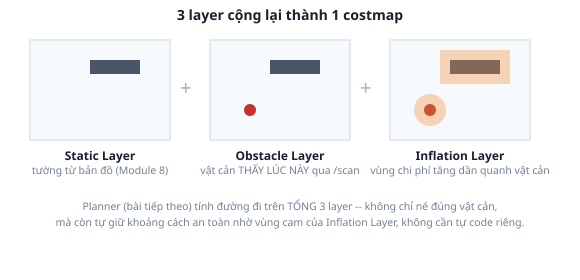

# 1. Costmap

*[← Mục lục module](00-gioi-thieu.md) · Tiếp theo: [Global planner →](02-global-planner.md)*

## Định nghĩa

**Costmap** là 1 occupancy grid (lưới ô vuông, mỗi ô mang 1 giá trị "chi phí" 0-255) phủ lên bản đồ — không chỉ đánh dấu "có vật cản hay không" như bản đồ thô từ [Module 8](../module-08-slam/00-gioi-thieu.md), mà còn mã hóa **mức độ nên tránh** từng vùng, để planner/controller tính toán trên đó thay vì trên dữ liệu thô.

## Cơ chế

3 layer cộng dồn lại thành costmap cuối cùng:



- **Static Layer**: đọc thẳng bản đồ `.pgm` đã lưu (Module 8) — tường cố định, không đổi.
- **Obstacle Layer**: cập nhật liên tục từ `/scan` — vật cản thấy ĐƯỢC NGAY LÚC NÀY (người đi ngang, thùng hàng di chuyển) mà bản đồ tĩnh không biết.
- **Inflation Layer**: không phải vật cản thật — vùng chi phí **tăng dần** quanh mỗi vật cản (bán kính `inflation_radius`), để planner tự nhiên "né rộng ra" thay vì cứ sượt sát mép tường.

**Global costmap vs Local costmap** — 2 instance riêng biệt, không phải 1:
- **Global costmap**: phủ TOÀN BỘ bản đồ, `update_frequency` thấp, dùng frame `map` ([REP-105, Module 2](../module-02-tf2-toa-do/03-rep103-rep105.md)) — cho global planner tìm đường dài hạn.
- **Local costmap**: cửa sổ nhỏ quanh robot (`width`/`height` vài mét), `update_frequency` CAO, dùng frame `odom` (mượt, không nhảy bậc) — cho controller né vật cản tức thời.

Dùng `odom` cho local costmap không phải tình cờ — đúng lý do REP-105 tách `map`/`odom` ở Module 2: controller cần dữ liệu liên tục, không nhảy.

## Ví dụ trong dự án Atlas

`atlas_slam/config/nav2_params_mppi.yaml` (chung cấu trúc cho cả 3 file controller) khai 2 khối costmap riêng:
```yaml
global_costmap:
  global_costmap:          # tên node lặp lại 2 lần -- quy ước của nav2_costmap_2d, không phải lỗi gõ
    ros__parameters:
      global_frame: map
      plugins: ["static_layer", "obstacle_layer", "inflation_layer"]

local_costmap:
  local_costmap:
    ros__parameters:
      global_frame: odom
      width: 3
      height: 3
      plugins: ["obstacle_layer", "inflation_layer"]   # KHÔNG có static_layer
```
Local costmap cố tình **không có `static_layer`** — chỉ quan tâm "vật cản thấy được ngay bây giờ" trong phạm vi hẹp, không cần tải lại toàn bộ bản đồ tĩnh mỗi lần cập nhật (tần số cao, càng nhẹ càng tốt).

## Thử ngay

```bash
ros2 launch atlas_bringup bringup.launch.py world:=maze.sdf
ros2 launch atlas_slam navigation.launch.py map:=$(pwd)/src/atlas_slam/maps/maze_map.yaml
```
RViz: bật display `Map` 2 lần, chọn topic `/global_costmap/costmap` và `/local_costmap/costmap` — xác nhận global costmap phủ cả bản đồ (gần như tĩnh), local costmap chỉ 1 ô vuông nhỏ bám theo robot, đổi liên tục. Đứng cạnh 1 bức tường, quan sát viền màu (inflation) lan dần ra từ tường — đó chính là vùng "chi phí tăng dần" vừa học.

---
*Tiếp theo: [Global planner →](02-global-planner.md)*
