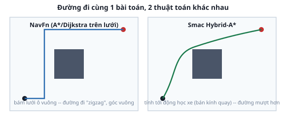

# 2. Global planner — tìm đường toàn cục

*[← Costmap](01-costmap.md) · [Mục lục module](00-gioi-thieu.md) · Tiếp theo: [Local controller →](03-local-controller.md)*

## Định nghĩa

**Global planner** tính 1 đường đi hoàn chỉnh từ vị trí hiện tại tới goal, trên **global costmap** ([bài trước](01-costmap.md)) — chạy 1 lần (hoặc định kỳ chậm), KHÔNG quan tâm robot bẻ lái mượt hay không, đó là việc của controller ([bài sau](03-local-controller.md)).

## Cơ chế



- **NavFn** (`nav2_navfn_planner`): tìm đường trên lưới ô vuông bằng Dijkstra (duyệt đều mọi hướng, luôn ra đường ngắn nhất) hoặc A* (dùng ước lượng khoảng cách tới đích để duyệt có định hướng hơn, thường nhanh hơn nhưng không đảm bảo ngắn nhất tuyệt đối). Không biết gì về động học robot (bán kính quay tối thiểu) — đường đi có thể có góc vuông mà robot thật khó bám sát ngay lập tức, phải nhờ controller "làm mượt" lại.
- **Smac Planner** (`nav2_smac_planner`, không cấu hình sẵn trong Atlas — giới thiệu để biết, không bắt buộc dùng): họ Hybrid-A*/lattice, tính TỚI động học (robot không thể quay tại chỗ theo mọi góc tùy ý nếu là xe có bán kính quay) — đường ra mượt hơn, sát thực tế hơn, nhưng tốn tính toán hơn NavFn.

Không có lựa chọn "luôn đúng" — robot diff-drive (quay tại chỗ được, không có bán kính quay tối thiểu như xe hơi) không hưởng lợi nhiều từ Hybrid-A*, đây là lý do NavFn đơn giản vẫn đủ dùng cho Atlas.

## Ví dụ trong dự án Atlas

`atlas_slam/config/nav2_params_mppi.yaml` (giống hệt ở 2 file controller kia — `planner_server` không đổi theo controller):
```yaml
planner_server:
  ros__parameters:
    planner_plugins: ["GridBased"]
    GridBased:
      plugin: "nav2_navfn_planner/NavfnPlanner"
      use_astar: false      # Dijkstra, KHÔNG phải A* -- dù tên "NavFn" hay gắn với A* trong tài liệu chung
      allow_unknown: true    # cho phép vạch đường qua vùng CHƯA quét (xám) -- risky nhưng cần thiết
                              # nếu world chưa quét hết, nếu không goal ở vùng xám sẽ bị từ chối thẳng
```
`use_astar: false` là lựa chọn CÓ CHỦ ĐÍCH trong dự án này — Dijkstra duyệt đều mọi hướng, chậm hơn A* một chút nhưng đảm bảo tìm đúng đường ngắn nhất tuyệt đối trên lưới, world Atlas đủ nhỏ để không đáng lo về tốc độ.

## Thử ngay

```bash
ros2 launch atlas_bringup bringup.launch.py world:=maze.sdf
ros2 launch atlas_slam navigation.launch.py map:=$(pwd)/src/atlas_slam/maps/maze_map.yaml
```
Gửi goal qua RViz ("Nav2 Goal", xem chi tiết ở [bài 5](05-gui-cli-goal.md)) tới 1 điểm sau góc cua — quan sát đường màu xanh (topic `/plan`) hiện ra NGAY LẬP TỨC (không cần robot nhúc nhích), xác nhận planner tính 1 lần trước khi controller bắt đầu bám theo.

```bash
ros2 topic echo /plan --once --no-arr | grep frame_id    # phải là "map" -- global planner luôn làm việc trên frame map
```

---
*Tiếp theo: [Local controller →](03-local-controller.md)*
