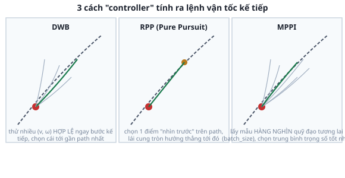

# 3. Local controller — DWB vs RPP vs MPPI

*[← Global planner](02-global-planner.md) · [Mục lục module](00-gioi-thieu.md) · Tiếp theo: [Behavior Tree Navigator →](04-behavior-tree-navigator.md)*

## Định nghĩa

**Local controller** (Nav2 gọi là `FollowPath`, chạy trong `controller_server`) biến đường đi tĩnh từ planner thành lệnh `cmd_vel` LIÊN TỤC, mỗi chu kỳ (vd 20Hz) — việc thật sự làm robot di chuyển, né vật cản phát sinh (local costmap), và là phần ảnh hưởng rõ nhất tới "cảm giác lái" của robot.

## Cơ chế



- **DWB** (Dynamic Window Approach): từ vận tốc hiện tại, chỉ xét các cặp `(v, ω)` ROBOT CÓ THỂ đạt được ở bước kế tiếp (giới hạn bởi gia tốc tối đa) — mô phỏng trước quỹ đạo ngắn cho từng cặp, chấm điểm (gần path, tránh vật cản, tốc độ), chọn cặp điểm cao nhất. Rẻ tính toán, phản ứng nhanh, nhưng "nhìn" không xa (dễ mắc kẹt ở cực tiểu cục bộ — chỗ nhìn có vẻ kẹt dù đường vòng bên cạnh thực ra thoáng).
- **RPP** (Regulated Pure Pursuit): chọn 1 điểm "nhìn trước" (lookahead point) trên đường đi, lái theo 1 cung tròn nối thẳng robot tới điểm đó — đơn giản, mượt, dễ tinh chỉnh (chỉnh khoảng cách lookahead là chính), nhưng "regulated" (tự giảm tốc khi cua gấp/gần vật cản) là phần thêm vào bản gốc Pure Pursuit để an toàn hơn.
- **MPPI** (Model Predictive Path Integral): lấy mẫu HÀNG NGHÌN quỹ đạo tương lai ngẫu nhiên (`batch_size`), mô phỏng trước mỗi quỹ đạo qua nhiều bước (`time_steps`), chấm điểm bằng nhiều "critic" cùng lúc (né vật cản, bám đường, hướng đúng...), lấy trung bình trọng số các quỹ đạo tốt làm lệnh thật. Nhìn xa nhất, né vật cản phức tạp tốt nhất, nhưng tốn CPU nhất trong 3 loại — và CÓ THAM SỐ NGẪU NHIÊN (`vx_std`/`wz_std`), nên 2 lần chạy cùng kịch bản có thể ra quỹ đạo hơi khác nhau.

Không có lựa chọn "tốt nhất tuyệt đối" — đây chính xác là nội dung [bài tập](06-bai-tap.md): tự đo, tự so sánh trên chính robot Atlas, không suy luận suông.

## Ví dụ trong dự án Atlas

3 file cấu hình, khác NHAU DUY NHẤT ở khối `FollowPath` (mọi khối khác — costmap, planner, BT — giống hệt, xem lại [01-cấu-trúc-workspace](../../overview/01-cau-truc-workspace.md)):

| File | Plugin |
|---|---|
| `nav2_params_dwb.yaml` | `dwb_core::DWBLocalPlanner` |
| `nav2_params_rpp.yaml` | `nav2_regulated_pure_pursuit_controller::RegulatedPurePursuitController` |
| `nav2_params_mppi.yaml` | `nav2_mppi_controller::MPPIController` |

**Lỗi thật vừa tìm và sửa khi viết bài này** — `nav2_params_mppi.yaml` từng có:
```yaml
vx_max: 0.7   # robot CHỈ đạt tối đa 0.5 m/s thật (atlas_control/diff_drive_controller.yaml, Module 5)
wz_max: 2.0   # robot CHỈ đạt tối đa 1.5 rad/s thật
```
MPPI lấy mẫu quỹ đạo giả định tốc độ *0.7 m/s*/*2.0 rad/s* — những tốc độ **robot không bao giờ đạt được** (`diff_drive_controller` tự cắt ở 0.5/1.5) — lãng phí 1 phần `batch_size` cho quỹ đạo bất khả thi, một dạng mất hiệu năng âm thầm (không crash, không log lỗi, chỉ đơn giản kém tối ưu hơn đáng lẽ). Đã sửa khớp đúng giới hạn thật — bài học: **giới hạn vận tốc khai trong Nav2 PHẢI khớp giới hạn vận tốc khai trong `ros2_control`** (Module 5), 2 lớp cấu hình độc lập, không ai tự đồng bộ hộ.

## Thử ngay

```bash
ros2 launch atlas_bringup bringup.launch.py world:=maze.sdf
ros2 launch atlas_slam navigation.launch.py controller:=mppi map:=$(pwd)/src/atlas_slam/maps/maze_map.yaml
```
```bash
ros2 param get /controller_server FollowPath.vx_max   # phải ra 0.5, không phải 0.7
```
Gửi 1 goal, quan sát `/local_plan` trong RViz (nếu bật display) hoặc cảm nhận trực tiếp chuyển động — ghi lại cảm giác (mượt/giật, có dừng khựng ở góc cua không) để so sánh ở [bài tập](06-bai-tap.md).

---
*Tiếp theo: [Behavior Tree Navigator →](04-behavior-tree-navigator.md)*
