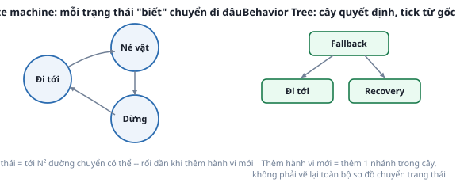

# 1. Behavior Tree là gì, so với state machine

*[← Mục lục module](00-gioi-thieu.md) · Tiếp theo: [Đọc BT XML →](02-doc-bt-xml.md)*

## Định nghĩa

**Behavior Tree (BT)** là cách mô tả logic điều khiển dưới dạng 1 CÂY (không phải sơ đồ trạng thái) — mỗi lần "tick" (cập nhật), hệ thống duyệt cây từ gốc, mỗi node trả về 1 trong 3 trạng thái: `SUCCESS`, `FAILURE`, hoặc `RUNNING` (đang làm dở).

## Cơ chế

**State machine truyền thống**: mỗi trạng thái tự "biết" nó có thể chuyển sang trạng thái nào khi nào — N trạng thái có thể cần tới N² đường chuyển, càng thêm hành vi mới càng rối, dễ quên 1 đường chuyển nào đó.

**Behavior Tree**: không trạng thái nào "biết" về trạng thái khác — mỗi node chỉ biết CON của nó. Node cha quyết định cách xử lý kết quả của con (chạy tuần tự, chạy cho tới khi 1 con thành công, chạy song song...). Thêm hành vi mới = thêm 1 nhánh, không phải vẽ lại cả sơ đồ.



4 loại node cốt lõi sẽ gặp ở [bài đọc XML](02-doc-bt-xml.md):
- **Action/Condition** (lá): làm 1 việc cụ thể (vd `Spin`, `Wait`) hoặc kiểm tra 1 điều kiện.
- **Sequence**: chạy con lần lượt, 1 con `FAILURE` là dừng cả nhánh.
- **Fallback** (hay `Selector`): chạy con lần lượt, 1 con `SUCCESS` là dừng — dùng cho "thử cách A, không được thì thử cách B".
- **RecoveryNode**: biến thể riêng của Nav2 — nếu con đầu `FAILURE`, chạy con thứ 2 (hành vi khắc phục) rồi THỬ LẠI con đầu, lặp tới N lần.

## Ví dụ trong dự án Atlas

`atlas_slam/launch/navigation.launch.py` khai `bt_navigator` dùng file BT **mặc định của chính Nav2** (`navigate_to_pose_w_replanning_and_recovery.xml`, cài sẵn trong `nav2_bt_navigator`) — dự án chưa tự viết BT riêng, nhưng mọi lần gửi goal ở Module 10 đều đã chạy qua đúng cây này. [Bài tiếp theo](02-doc-bt-xml.md) đọc nguyên văn file đó.

## Thử ngay

```bash
find /opt/ros/humble/share/nav2_bt_navigator/behavior_trees/ -name "*.xml"
```
Có hơn 10 file BT khác nhau cài sẵn — mỗi file ứng với 1 chiến lược điều hướng khác nhau (replanning theo thời gian, theo khoảng cách, chỉ khi path không còn hợp lệ...). Atlas dùng đúng 1 trong số đó — tên file dễ đoán nếu đọc kỹ (gợi ý: tên có "w_replanning_and_recovery").

---
*Tiếp theo: [Đọc BT XML →](02-doc-bt-xml.md)*
