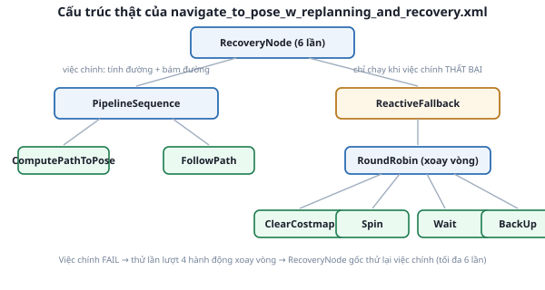

# 2. Đọc file BT XML mặc định của Atlas

*[← Behavior Tree vs state machine](01-behavior-tree-vs-state-machine.md) · [Mục lục module](00-gioi-thieu.md) · Tiếp theo: [Recovery behaviors →](03-recovery-behaviors.md)*

## Định nghĩa

File BT là XML thuần — không cần học ngôn ngữ lập trình mới, chỉ cần biết tên + ý nghĩa từng thẻ. Toàn bộ cây Atlas đang dùng nằm gọn trong 1 file 37 dòng.

## Cơ chế



Đọc từ ngoài vào trong:
```xml
<RecoveryNode number_of_retries="6" name="NavigateRecovery">
  <PipelineSequence name="NavigateWithReplanning">
    <RateController hz="1.0">
      <RecoveryNode number_of_retries="1" name="ComputePathToPose">
        <ComputePathToPose goal="{goal}" path="{path}" planner_id="GridBased"/>
        <ClearEntireCostmap name="ClearGlobalCostmap-Context" .../>
      </RecoveryNode>
    </RateController>
    <RecoveryNode number_of_retries="1" name="FollowPath">
      <FollowPath path="{path}" controller_id="FollowPath"/>
      <ClearEntireCostmap name="ClearLocalCostmap-Context" .../>
    </RecoveryNode>
  </PipelineSequence>
  <ReactiveFallback name="RecoveryFallback">
    ...
  </ReactiveFallback>
</RecoveryNode>
```
- Toàn bộ nằm trong **1** `RecoveryNode` gốc, tối đa **6 lần thử lại** — nếu cả 6 lần đều thất bại, goal báo `FAILED` thật sự.
- `PipelineSequence` = việc chính: `RateController hz="1.0"` giới hạn gọi `ComputePathToPose` tối đa 1 lần/giây (tính lại đường đi định kỳ — đúng khái niệm "replanning" trong tên file), rồi `FollowPath` bám theo.
- 2 `RecoveryNode` LỒNG BÊN TRONG (1 lần thử lại) quanh `ComputePathToPose` và `FollowPath` — nếu 1 trong 2 việc đó thất bại, tự `ClearEntireCostmap` (xóa sạch costmap, tính lại từ `/scan` mới nhất — hữu ích khi costmap "nhớ nhầm" vật cản đã hết tồn tại) rồi thử lại NGAY LẬP TỨC trước khi báo FAILURE lên node cha.
- `{goal}`, `{path}` là **blackboard** — biến dùng chung giữa các node trong cây (giống biến toàn cục có giới hạn phạm vi), không phải cú pháp lạ.

Chỉ khi CẢ chuỗi `PipelineSequence` thất bại (ComputePathToPose và/hoặc FollowPath thất bại sau khi đã tự dọn costmap mà vẫn không xong), `ReactiveFallback` mới kích hoạt — đúng nội dung [bài tiếp theo](03-recovery-behaviors.md).

## Ví dụ trong dự án Atlas

Chính file này quyết định HÀNH VI THẬT bạn đã thấy ở Module 10 khi gửi goal — không phải code C++ ẩn trong `bt_navigator`. Muốn đổi "tính lại đường mỗi 1 giây" thành "mỗi 2 giây", chỉ cần sửa `hz="1.0"` thành `hz="0.5"` trong file XML, không đụng gì tới code Python/C++.

## Thử ngay

```bash
cat /opt/ros/humble/share/nav2_bt_navigator/behavior_trees/navigate_to_pose_w_replanning_and_recovery.xml
```
Đối chiếu từng dòng với sơ đồ ở trên — tìm đúng vị trí của `RateController`, 2 `RecoveryNode` lồng bên trong, và `ReactiveFallback`.

---
*Tiếp theo: [Recovery behaviors →](03-recovery-behaviors.md)*
