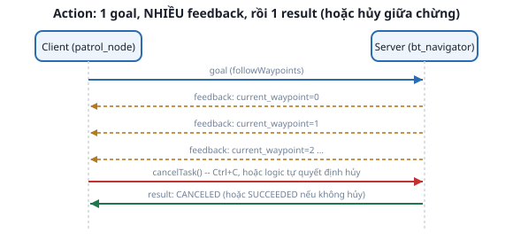

# 1. Action client/server — vì sao navigation phải dùng action

*[← Mục lục module](00-gioi-thieu.md) · Tiếp theo: [Nav2 Simple Commander →](02-nav2-simple-commander.md)*

## Định nghĩa

**Action** là mô hình giao tiếp thứ 3 (sau topic và service, [Module 1](../module-01-ros2-core-concepts/00-gioi-thieu.md)): dùng cho tác vụ **mất thời gian dài**, cần **feedback liên tục** trong lúc chạy, và có thể **hủy giữa chừng** — 3 đặc điểm service không có.

## Cơ chế



So lại với 2 mô hình đã học:

| | Topic | Service | Action |
|---|---|---|---|
| Phản hồi | Không | 1 lần, nhanh | Nhiều lần (feedback) + 1 lần cuối (result) |
| Thời lượng | Liên tục | Ngắn | Dài, không biết trước |
| Hủy được? | Không áp dụng | Không | Có |

`NavigateToPose`, `FollowWaypoints` ([bài sau](02-nav2-simple-commander.md)) đều là action, không phải service — vì đi tới 1 điểm có thể mất hàng chục giây, client cần biết "đang đi tới đâu rồi" (feedback), và có quyền đổi ý giữa chừng (hủy) mà không phải đợi xong mới dừng được.

Bên trong, action = 1 cặp topic + vài service ẩn (không cần tự quản lý): gửi goal, nhận feedback, nhận result — client code thường không thấy phần "lắp ráp" này vì các thư viện wrapper ([bài sau](02-nav2-simple-commander.md)) đã làm sẵn.

## Ví dụ trong dự án Atlas

Đã gặp `/navigate_to_pose` ở [Module 10](../module-10-nav2-core/04-behavior-tree-navigator.md) — `bt_navigator` còn mở 1 action khác, dùng chính ở module này:
```bash
ros2 node info /bt_navigator | grep -A3 "Action Servers"
```
`/navigate_through_poses` và `/navigate_to_pose` cả hai đều tồn tại — module này thêm 1 action nữa, do `waypoint_follower` (đã chạy sẵn từ Module 10, chưa dùng tới) mở ra: `/follow_waypoints`.

## Thử ngay

```bash
ros2 launch atlas_bringup bringup.launch.py world:=maze.sdf
ros2 launch atlas_slam navigation.launch.py map:=$(pwd)/src/atlas_slam/maps/maze_map.yaml
```
```bash
ros2 node info /waypoint_follower | grep -A3 "Action Servers"
ros2 action info /follow_waypoints
```
Xác nhận kiểu action là `nav2_msgs/action/FollowWaypoints` — khác `NavigateToPose` ở chỗ nhận MỘT MẢNG pose, không phải 1 pose đơn.

---
*Tiếp theo: [Nav2 Simple Commander →](02-nav2-simple-commander.md)*
