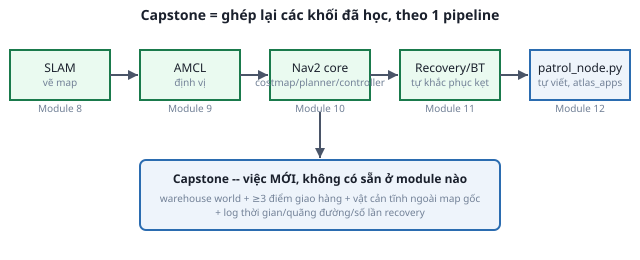

# Module 13 — Đồ án cuối khóa (Capstone)

*Giai đoạn 4: Capstone. Xem vị trí module này trong lộ trình đầy đủ ở [02-lo-trinh-khoa-hoc.md](../../overview/02-lo-trinh-khoa-hoc.md). Trước module này cần xong [Module 12](../module-12-waypoint/00-gioi-thieu.md) — đây là module CUỐI, không giới thiệu khái niệm mới, chỉ ghép lại mọi thứ đã học.*

**Thời lượng ước tính**: 1-2 tuần.

## Khác các module trước ở điểm gì

Module 1-12 mỗi bài = 1 khái niệm mới (Định nghĩa → Cơ chế → Ví dụ → Thử ngay). Module 13 **không có khái niệm mới** — toàn bộ lý thuyết cần thiết đã học hết. Việc duy nhất còn lại là **tự ghép** các khối đã chạy riêng lẻ (SLAM, AMCL, Nav2, waypoint app) thành 1 kịch bản hoàn chỉnh, có ý nghĩa thực tế.

Đề bài chi tiết, yêu cầu tối thiểu, phần mở rộng tùy chọn và rubric chấm điểm đã viết đầy đủ ở **[docs/overview/04-capstone-va-danh-gia.md](../../overview/04-capstone-va-danh-gia.md)** — đọc file đó trước, file này chỉ tóm tắt và chỉ đường cách bắt đầu.

## Tóm tắt yêu cầu tối thiểu

1. SLAM tự vẽ map world mới (không phải `maze.sdf` đã quen — tự thiết kế world "warehouse" đơn giản hoặc tùy biến `maze.sdf`), dùng [Module 8](../module-08-slam/00-gioi-thieu.md).
2. AMCL định vị đúng trên map vừa lưu, dùng [Module 9](../module-09-amcl/00-gioi-thieu.md).
3. ≥ 3 điểm giao hàng, đi lần lượt bằng Nav2 + waypoint app tự viết, dùng [Module 10](../module-10-nav2-core/00-gioi-thieu.md) + [Module 12](../module-12-waypoint/00-gioi-thieu.md) (mở rộng từ `patrol_node.py`, không lặp vô hạn nữa mà dừng sau khi giao hết).
4. Né được vật cản tĩnh KHÔNG có trong map gốc (đặt thêm hộp sau khi đã lưu map) — kiểm chứng costmap + inflation, dùng [Module 10](../module-10-nav2-core/01-costmap.md).
5. Log thật: tổng thời gian, quãng đường, số lần recovery kích hoạt — dùng [Module 11](../module-11-recovery-bt/00-gioi-thieu.md).

## Cách bắt đầu

1. **Thiết kế world** — copy `atlas_gazebo/worlds/maze.sdf` làm điểm xuất phát, thêm/bớt tường để tạo layout "kho" (dãy kệ, lối đi). Giữ nguyên khối vật lý (`dartsim` + `collision_detector: bullet`) đã fix bug xuyên tường ([ghi chú trong Module 8](../module-08-slam/00-gioi-thieu.md)) — đừng viết lại từ đầu.
2. **Lưu map** — lặp lại quy trình SLAM + `map_saver_cli` ([Module 8](../module-08-slam/03-luu-ban-do.md)) trên world mới.
3. **Viết code giao hàng** — mở rộng trực tiếp từ `patrol_node.py` ([Module 12, bài tập](../module-12-waypoint/03-bai-tap.md)): thay vòng lặp vô hạn bằng 1 lượt chạy hết danh sách rồi dừng, thêm đo thời gian (`time.monotonic()` trước/sau `followWaypoints()`) và đếm recovery (subscribe topic hoặc đọc log `bt_navigator`, [Module 11](../module-11-recovery-bt/02-doc-bt-xml.md)).
4. **Viết trong `atlas_apps`** — đúng package trống dành cho học viên (xem [00-gioi-thieu Module 12](../module-12-waypoint/00-gioi-thieu.md)), không sửa code mẫu trong `atlas_slam`.
5. **Nộp bài** — copy [template-README.md](template-README.md) vào package của bạn, điền đủ 7 mục, kèm video demo.

## Tự kiểm tra trước khi nộp

- [ ] Chạy được end-to-end từ `ros2 launch` đầu tiên tới giao hết các điểm, không cần can thiệp tay giữa chừng.
- [ ] Có log/số liệu thật (không phải ước lượng) cho thời gian, quãng đường, số lần recovery.
- [ ] Giải thích được vì sao chọn planner/controller này (đọc lại [so sánh Module 10](../module-10-nav2-core/03-local-controller.md) nếu quên) — phần "Hiểu lý thuyết" trong rubric sẽ hỏi trực tiếp.
- [ ] File nộp theo đúng khung [template-README.md](template-README.md).

Hoàn thành Module 13 = hoàn thành khóa học.
